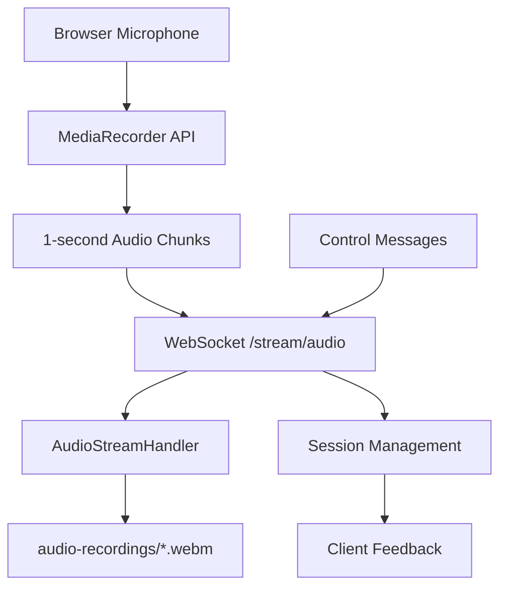

# A Audio Streaming System Documentation

## Overview

This audio streaming system provides real-time audio capture and streaming capabilities using WebSocket technology. It's built with vanilla JavaScript and Web Components, integrating seamlessly with the existing Deno server architecture.

## Architecture

### Components

1. **Server Side**
   - [`server/src/audio-stream.ts`](server/src/audio-stream.ts) - Audio streaming WebSocket handler
   - [`server/src/main.ts`](server/src/main.ts) - Main server with `/stream/audio` endpoint
   - [`audio-recordings/`](audio-recordings/) - Directory for saved audio files

2. **Client Side**
   - [`wc/audio-streamer.js`](wc/audio-streamer.js) - Web component for audio streaming
   - [`sites/audio-streamer.html`](sites/audio-streamer.html) - Demo page and documentation

### Data Flow



## Installation & Setup

### Prerequisites
- Deno runtime environment
- Modern web browser with MediaRecorder API support
- Microphone access permission

### Server Setup
1. The audio streaming functionality is already integrated into the main server
2. Start the server with proper permissions:
   ```bash
   cd server
   deno run --allow-net --allow-write --allow-read --allow-env src/main.ts
   ```
3. Server will listen on port 8081 with WebSocket endpoint at `/stream/audio`

### Directory Structure
```
├── server/src/
│   ├── audio-stream.ts     # Audio WebSocket handler
│   └── main.ts            # Main server (updated)
├── wc/
│   └── audio-streamer.js  # Web component
├── sites/
│   └── audio-streamer.html # Demo page
└── audio-recordings/      # Audio files directory
```

## Usage

### Basic Implementation

1. **Include the Web Component**
   ```html
   <script type="module" src="/wc/audio-streamer.js"></script>
   ```

2. **Use the Component**
   ```html
   <audio-streamer 
     server-url="ws://localhost:8081/stream/audio"
     theme="light"
     chunk-interval="1000"
     show-status="true">
   </audio-streamer>
   ```

### Component Attributes

| Attribute | Default | Description |
|-----------|---------|-------------|
| `server-url` | `ws://localhost:8081/stream/audio` | WebSocket endpoint URL |
| `theme` | `light` | Visual theme (`light` or `dark`) |
| `chunk-interval` | `1000` | Audio chunk interval in milliseconds |
| `show-status` | `true` | Show/hide status information |

### JavaScript API

```javascript
const streamer = document.querySelector('audio-streamer');

// Start streaming programmatically
await streamer.startStreaming();

// Stop streaming
await streamer.stopStreaming();

// Get current status
const status = streamer.getStatus();
console.log(status.isStreaming, status.sessionId);

// Send ping to server
streamer.ping();
```

### Event Handling

```javascript
const streamer = document.querySelector('audio-streamer');

streamer.addEventListener('streaming-started', (event) => {
  console.log('Session ID:', event.detail.sessionId);
});

streamer.addEventListener('streaming-stopped', (event) => {
  console.log('Streaming stopped');
});

streamer.addEventListener('streaming-error', (event) => {
  console.error('Error:', event.detail.message);
});
```

## Technical Details

### Audio Format
- **Container**: WebM
- **Codec**: Opus (preferred) or default WebM audio codec
- **Chunk Size**: 1-second intervals (configurable)
- **Quality**: Browser default with echo cancellation, noise suppression, and auto gain control

### WebSocket Protocol

#### Client → Server Messages

1. **Audio Data (Binary)**
   - Raw audio chunks as Blob objects
   - Automatically sent every chunk interval during streaming

2. **Control Messages (JSON)**
   ```json
   {
     "type": "ping"
   }
   ```

#### Server → Client Messages

1. **Session Started**
   ```json
   {
     "type": "session_started",
     "sessionId": "audio_1640123456789_abc123",
     "timestamp": "2024-01-01T12:00:00.000Z"
   }
   ```

2. **Pong Response**
   ```json
   {
     "type": "pong",
     "timestamp": "2024-01-01T12:00:00.000Z"
   }
   ```

3. **Error Messages**
   ```json
   {
     "type": "error",
     "message": "Error description",
     "timestamp": "2024-01-01T12:00:00.000Z"
   }
   ```

### File Storage

Audio files are saved in the `audio-recordings/` directory with the following naming convention:
```
YYYY-MM-DD_HH-MM-SS_audio_TIMESTAMP_SESSIONID.webm
```

Example: `2024-01-01_12-30-45_audio_1640123456789_abc123.webm`

## Security Considerations

### Browser Security
- **Microphone Permission**: Explicit user consent required
- **HTTPS Requirement**: For production, use HTTPS/WSS to avoid mixed content issues
- **Same-Origin Policy**: WebSocket connections respect browser security policies

### Server Security
- **Input Validation**: All WebSocket messages are validated
- **File System**: Audio files are written to a controlled directory
- **Session Management**: Unique session IDs prevent conflicts
- **Error Handling**: Graceful failure without exposing internal details

### Production Recommendations
1. Use WSS (WebSocket Secure) in production
2. Implement authentication/authorization
3. Add rate limiting for WebSocket connections
4. Consider audio file cleanup policies
5. Monitor disk space usage

## Browser Compatibility

| Feature | Chrome | Firefox | Safari | Edge |
|---------|--------|---------|--------|------|
| MediaRecorder API | ✅ 47+ | ✅ 25+ | ⚠️ 14.1+ | ✅ 79+ |
| WebSocket API | ✅ | ✅ | ✅ | ✅ |
| Web Components | ✅ | ✅ | ✅ | ✅ |
| WebM/Opus | ✅ | ✅ | ❌ | ✅ |

**Note**: Safari has limited MediaRecorder support and doesn't support WebM/Opus. The component automatically falls back to supported formats.

## Troubleshooting

### Common Issues

1. **Microphone Permission Denied**
   - Ensure HTTPS in production
   - Check browser permission settings
   - Clear site data and retry

2. **WebSocket Connection Failed**
   - Verify server is running on correct port
   - Check firewall settings
   - Ensure TOKEN environment variable is set

3. **No Audio Data Received**
   - Check browser console for MediaRecorder errors
   - Verify microphone is not used by other applications
   - Test with different audio input devices

4. **File Not Saved**
   - Ensure server has write permissions
   - Check disk space availability
   - Verify `audio-recordings` directory exists

### Debug Mode

Enable debug logging in the web component:
```javascript
// Add to browser console
window.audioStreamerDebug = true;
```

### Server Logs

Monitor server console for audio streaming events:
```bash
# Look for these log patterns:
Audio streaming session started: audio_*
Received and saved audio chunk: * bytes
Audio streaming WebSocket closed
```

## Extensions & Customization

### Adding Audio Processing
Extend the `AudioStreamHandler` class to add real-time processing:

```typescript
// In audio-stream.ts
private async handleAudioChunk(audioBlob: Blob): Promise<void> {
  // Save original
  await this.saveAudioChunk(audioBlob);
  
  // Add processing (e.g., transcription, analysis)
  await this.processAudio(audioBlob);
}
```

### Custom File Formats
Modify the web component to support different formats:

```javascript
// In audio-streamer.js
const mimeType = MediaRecorder.isTypeSupported('audio/mp4') 
  ? 'audio/mp4' 
  : 'audio/webm';
```

### Integration with Other Services
- **Speech-to-Text**: Send audio chunks to transcription APIs
- **Audio Analysis**: Integrate with audio processing libraries
- **Cloud Storage**: Upload files to AWS S3, Google Cloud, etc.
- **Real-time Communication**: Broadcast audio to multiple clients

## Demo & Testing

1. **Access Demo Page**
   - Start the server
   - Navigate to `http://localhost:8081/sites/audio-streamer.html`
   - Click "Start Streaming" and grant microphone permission

2. **Test Features**
   - Theme switching (light/dark)
   - Real-time status updates
   - Event logging
   - Keyboard shortcuts (Ctrl+S, Ctrl+Q, Ctrl+P)

3. **Verify Audio Files**
   - Check `audio-recordings/` directory for saved files
   - Play back recordings to verify quality

## API Reference

### AudioStreamer Class

#### Methods
- `startStreaming()` - Begin audio capture and streaming
- `stopStreaming()` - Stop audio capture and close connections
- `getStatus()` - Get current streaming status
- `ping()` - Send ping message to server

#### Events
- `streaming-started` - Fired when streaming begins
- `streaming-stopped` - Fired when streaming ends
- `streaming-error` - Fired on errors

#### Properties
- `isStreaming` - Boolean indicating streaming state
- `sessionId` - Current session identifier

### AudioStreamHandler Class

#### Methods
- `handleWebSocketConnection(socket)` - Setup WebSocket event handlers
- `getSessionId()` - Get current session ID
- `getAudioFilePath()` - Get audio file path

This documentation provides everything needed to understand, implement, and extend the audio streaming system.