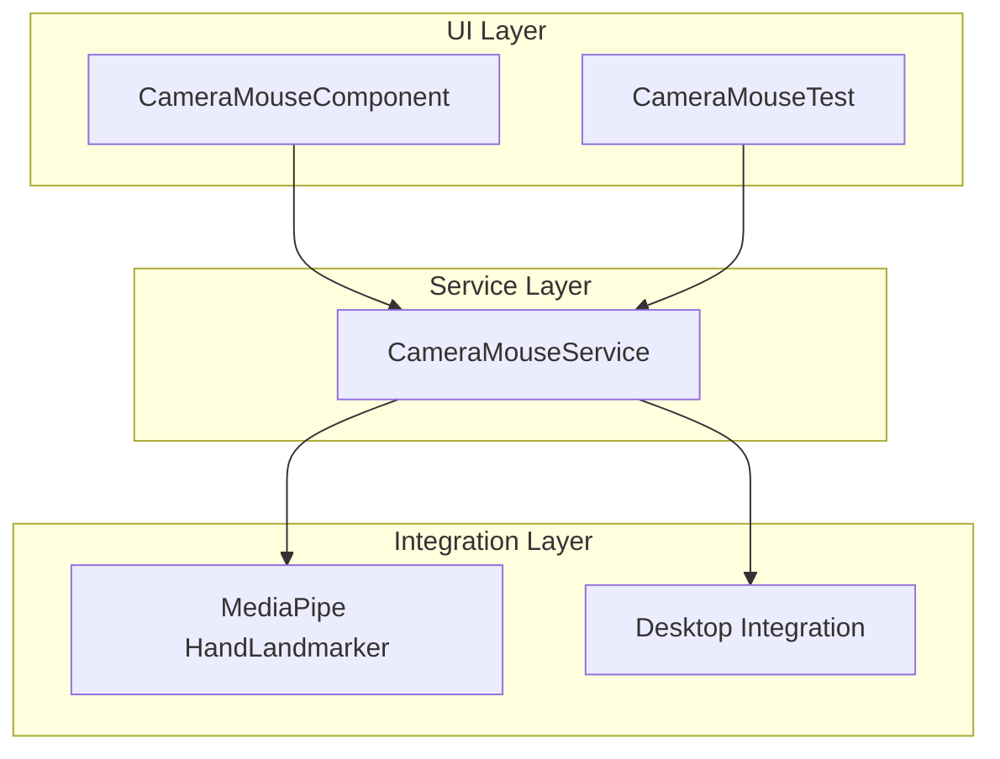

# Camera Mouse Controller – System Architecture Overview

## Purpose

This document provides a high-level overview of the architecture for the Camera Mouse Controller, enabling new developers to quickly understand the system’s structure, core components, and data flows.

---

## Component Relationships

---

## Core Components

- **CameraMouseComponent**: Main web component for user interaction and UI.
- **CameraMouseService**: Core logic for camera access, hand tracking, gesture recognition, and mouse event simulation.
- **CameraMouseTest**: Interactive test harness for manual and visual validation.
- **MediaPipe HandLandmarker**: External library for real-time hand landmark detection.
- **Desktop Integration**: Optional bridge for controlling the mouse in desktop environments.

---

## Data Flow Overview

1. **Camera Input**: Video stream is captured from the user's camera.
2. **Hand Landmark Detection**: MediaPipe processes video frames to extract hand landmarks.
3. **Gesture Recognition**: CameraMouseService analyzes landmarks to detect gestures (point, click, scroll, etc.).
4. **Coordinate Transformation**: Hand positions are mapped to screen or desktop coordinates.
5. **Mouse Event Simulation**: Gestures are translated into mouse events for the UI or desktop.
6. **Event Dispatch**: Events are emitted to UI components and, if enabled, to the desktop integration layer.

---

## Key Architectural Principles

- **Separation of Concerns**: UI, service logic, and integration are modular and loosely coupled.
- **Event-Driven Communication**: Custom events are used for decoupled component interaction.
- **Progressive Enhancement**: Works in browser-only mode or with desktop integration.
- **Configurability**: Sensitivity, smoothing, and gesture settings are customizable.

---

## Next Steps

- Drill down into each component’s responsibilities and APIs.
- Document gesture recognition algorithms and tracking pipeline.
- Provide visual workflow diagrams and onboarding guides.
