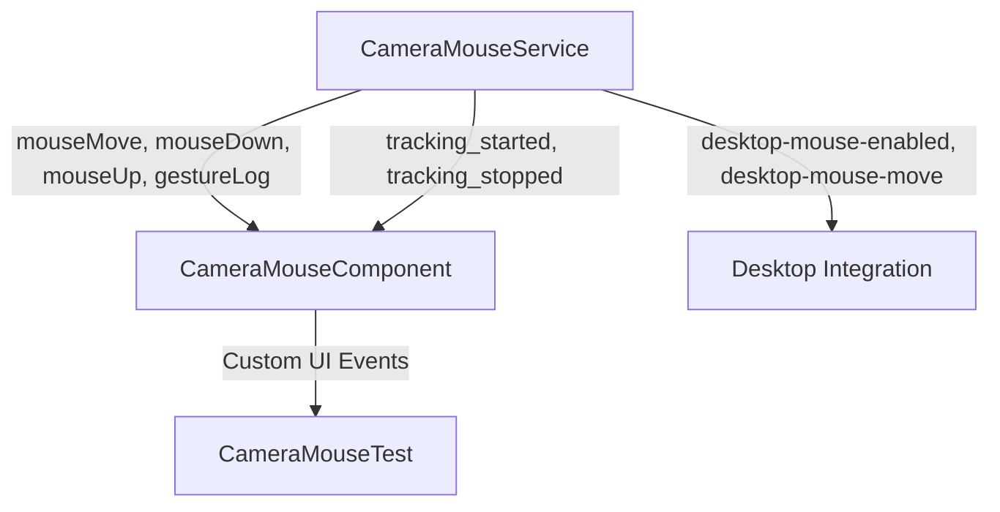

# Event System & Integration Patterns

This document describes the event-driven architecture used for communication between the Camera Mouse service, UI components, and desktop integration.

---

## Event Flow Diagram



---

## Core Events

- **mouseMove**: Emitted when the cursor position is updated.
- **mouseDown / mouseUp**: Emitted for click and release gestures.
- **gestureLog**: Emitted for gesture recognition feedback and debugging.
- **tracking_started / tracking_stopped**: Emitted when tracking state changes.
- **desktop-mouse-enabled / desktop-mouse-move**: Emitted for desktop integration (if enabled).

---

## Event System Principles

- **Decoupling**: UI components and services communicate via events, not direct method calls.
- **Custom Events**: All events are dispatched as CustomEvent instances with detailed payloads.
- **Bubbling**: Events bubble up the DOM, allowing parent components to listen and react.
- **Integration**: Desktop integration listens for specific events to control the OS mouse.

---

## Example: Listening for Events

```javascript
cameraMouseService.addEventListener('mouseMove', (event) => {
  const { x, y } = event.detail;
  // Update UI or trigger actions
});
```

---

## Integration Patterns

- **UI Integration**: Components listen for service events and update the interface accordingly.
- **Testing Harness**: The test component logs and visualizes events for manual validation.
- **Desktop Integration**: When enabled, service emits desktop-specific events for OS-level control.

---

## Extending the Event System

- New gestures or features can introduce additional custom events.
- Always document event names, payload structure, and intended consumers.
