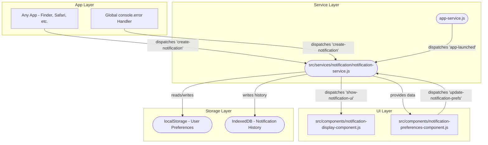
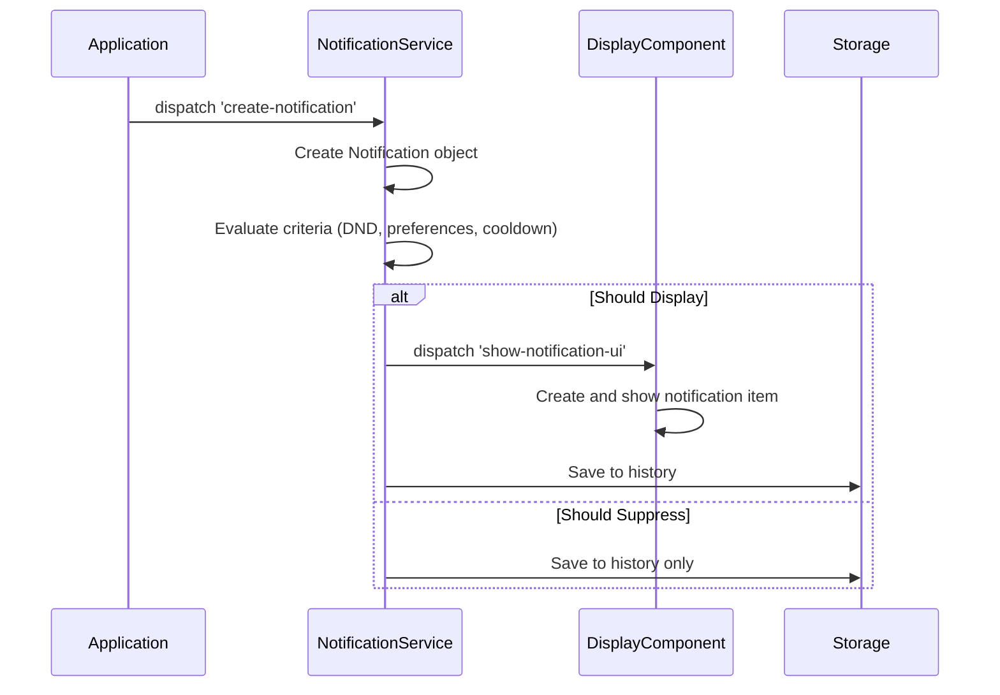
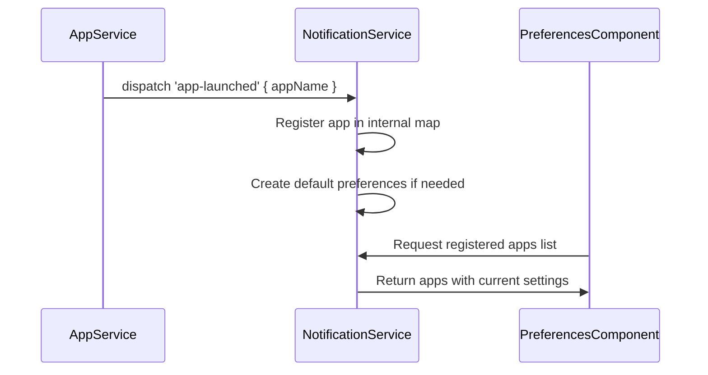

# Desktop Notification System - Comprehensive Design Document

## Overview

This document outlines the design and implementation plan for a macOS-style notification system for the desktop environment. The system will provide non-intrusive, timely feedback about system and application events with full user control over preferences.

## Architecture Overview



## File Structure

```
src/
└── services/
    └── notification/
        ├── notification-service.js              # Combined service + data model
        ├── notification-display-component.js    # Display, stacking, individual items
        └── notification-preferences-component.js # Settings pane for System Preferences
```

## Phase 1: Core Service and Data Model

### File: `src/services/notification/notification-service.js`

This single file will contain:

#### 1. Notification Data Model
```javascript
class Notification {
    constructor({
        sourceAppId,        // REQUIRED: 'finder', 'system', etc.
        title,             // REQUIRED: Main heading
        body,              // REQUIRED: Detailed message
        icon = null,       // Optional: URL or emoji. Falls back to app icon
        priority = 'medium', // 'low', 'medium', 'high', 'critical'
        actions = [],      // [{ label: 'Reply', actionId: 'reply-to-message' }]
        isSilent = false,  // If true, goes to history only, no banner
        canCoalesce = true, // If false, must be shown separately
        coalesceId = null, // Grouping key for similar notifications
        sound = true,      // Whether to play notification sound
        persistent = false // If true, requires manual dismissal
    }) {
        this.id = crypto.randomUUID();
        this.timestamp = Date.now();
        this.sourceAppId = sourceAppId;
        this.title = title;
        this.body = body;
        this.icon = icon;
        this.priority = priority;
        this.actions = actions;
        this.isSilent = isSilent;
        this.canCoalesce = canCoalesce;
        this.coalesceId = coalesceId || `${sourceAppId}-${title}`;
        this.sound = sound;
        this.persistent = persistent;
        this.isRead = false;
        this.isDismissed = false;
    }
}
```

#### 2. NotificationService Class
```javascript
class NotificationService {
    constructor() {
        this.registeredApps = new Map(); // appId -> { name, icon }
        this.activeNotifications = new Map(); // id -> Notification
        this.preferences = this.loadPreferences();
        this.isDoNotDisturb = false;
        this.cooldownMap = new Map(); // coalesceId -> timestamp
        
        this.initializeEventListeners();
        this.initializeErrorHandling();
    }
    
    // Core Methods:
    // - handleCreateNotification(event)
    // - handleAppLaunched(event) 
    // - evaluateNotificationCriteria(notification)
    // - displayNotification(notification)
    // - coalesceNotifications(notification)
    // - saveToHistory(notification)
    // - loadPreferences() / savePreferences()
    // - setDoNotDisturb(enabled)
    // - updateAppPreferences(appId, settings)
}
```

#### 3. Key Features in Phase 1:
- **Event Listening**: Listen for `create-notification` and `app-launched` events
- **App Registration**: Automatically register apps when they launch via `app-launched` event
- **Notification Filtering**: Priority thresholds, Do Not Disturb, user preferences
- **Coalescing**: Group similar notifications to prevent spam
- **Cooldown Logic**: Prevent duplicate notifications within time windows
- **Persistence**: Save preferences to localStorage, history to IndexedDB
- **Error Routing**: Global console.error wrapper that creates system notifications

## Phase 2: Display Component

### File: `src/services/notification/notification-display-component.js`

This single web component handles all display aspects:

#### 1. Component Structure
```javascript
class NotificationDisplayComponent extends HTMLElement {
    constructor() {
        super();
        this.attachShadow({ mode: 'open' });
        this.activeNotifications = [];
        this.notificationStack = null;
    }
    
    // Methods:
    // - render() - Creates the notification container
    // - showNotification(notificationData)
    // - createNotificationItem(notification)
    // - stackNotifications()
    // - dismissNotification(id)
    // - handleNotificationClick(notification)
    // - handleActionClick(notification, actionId)
}
```

#### 2. Features:
- **Stacking**: Vertical stack in top-right corner with proper spacing
- **Individual Items**: Each notification as a styled card with icon, title, body, actions
- **Animations**: Slide-in from right, fade-out on dismiss, smooth stacking adjustments
- **Interactions**: Click to open app, action buttons, swipe-to-dismiss
- **Auto-dismiss**: Configurable timeout (except for persistent notifications)
- **Accessibility**: Proper ARIA roles, keyboard navigation, screen reader support

#### 3. Styling:
- **macOS-inspired**: Rounded corners, subtle shadows, translucent background
- **Responsive**: Adapts to different screen sizes
- **Dark/Light Mode**: Respects system theme preferences
- **Priority Indicators**: Visual cues for different priority levels

## Phase 3: Preferences Component

### File: `src/services/notification/notification-preferences-component.js`

A settings pane designed for integration into a future System Preferences app:

#### 1. Component Structure
```javascript
class NotificationPreferencesComponent extends HTMLElement {
    constructor() {
        super();
        this.attachShadow({ mode: 'open' });
        this.notificationService = null;
        this.registeredApps = [];
    }
    
    // Methods:
    // - render() - Creates the preferences UI
    // - loadAppList()
    // - renderAppSettings(app)
    // - handleGlobalSettings()
    // - handleAppToggle(appId, enabled)
    // - handleSoundToggle(appId, enabled)
    // - handlePriorityChange(appId, priority)
}
```

#### 2. Features:
- **Global Settings**: Do Not Disturb toggle, global sound toggle, notification position
- **Per-App Settings**: Enable/disable, sound on/off, priority threshold
- **App List**: Dynamic list of all registered applications with icons and names
- **Batch Operations**: "Allow All", "Silence All" quick actions
- **Schedule**: Do Not Disturb scheduling (future enhancement)

## Integration Points

### 1. Existing App Service Integration
- **No modifications needed** to [`src/services/app-service.js`](src/services/app-service.js:274)
- Leverage existing `app-launched` event dispatched at line 274-280
- Event payload: `{ appName }` - sufficient for registration

### 2. Global Error Handling
- Wrap `console.error` in main application entry point
- Route errors as system notifications with `sourceAppId: 'system'`
- Include error message, stack trace snippet, and "View Details" action

### 3. Custom Event API
Applications can create notifications by dispatching:
```javascript
document.dispatchEvent(new CustomEvent('create-notification', {
    detail: {
        sourceAppId: 'finder',
        title: 'File Deleted',
        body: "Moved 'document.pdf' to Trash",
        icon: '🗑️',
        priority: 'medium',
        actions: [
            { label: 'Undo', actionId: 'undo-delete' },
            { label: 'Open Trash', actionId: 'open-trash' }
        ]
    }
}));
```

## Data Flow

### 1. Notification Creation Flow


### 2. App Registration Flow


## Technical Specifications

### 1. Storage Schema

#### localStorage (Preferences)
```javascript
{
    "notification-preferences": {
        "globalSettings": {
            "doNotDisturb": false,
            "globalSound": true,
            "position": "top-right",
            "defaultTimeout": 5000
        },
        "appSettings": {
            "finder": { "enabled": true, "sound": true, "priority": "medium" },
            "system": { "enabled": true, "sound": true, "priority": "high" }
        }
    }
}
```

#### IndexedDB (History)
```javascript
// Database: "NotificationHistory"
// Store: "notifications"
{
    id: "uuid",
    timestamp: 1704067200000,
    sourceAppId: "finder",
    title: "File Downloaded",
    body: "document.pdf (2.3 MB)",
    priority: "medium",
    isRead: false,
    isDismissed: true
}
```

### 2. Event Specifications

#### create-notification
```javascript
{
    type: 'create-notification',
    detail: {
        sourceAppId: string,    // Required
        title: string,          // Required  
        body: string,           // Required
        icon?: string,          // Optional
        priority?: string,      // Optional, default 'medium'
        actions?: Array,        // Optional
        isSilent?: boolean,     // Optional, default false
        persistent?: boolean    // Optional, default false
    }
}
```

#### show-notification-ui
```javascript
{
    type: 'show-notification-ui',
    detail: {
        notification: Notification, // Full notification object
        shouldStack: boolean,       // Whether to add to stack or replace
        timeout?: number           // Custom timeout override
    }
}
```

## Implementation Timeline

### Phase 1: Foundation (Week 1)
- [ ] Create `src/services/notification/notification-service.js`
- [ ] Implement Notification data model
- [ ] Implement NotificationService class
- [ ] Add event listeners for `create-notification` and `app-launched`
- [ ] Implement basic filtering logic (DND, preferences)
- [ ] Add localStorage preferences persistence
- [ ] Add IndexedDB history storage
- [ ] Implement global console.error wrapper

### Phase 2: Display (Week 2)
- [ ] Create `src/services/notification/notification-display-component.js`
- [ ] Implement notification item rendering
- [ ] Add stacking and positioning logic
- [ ] Implement animations (slide-in, fade-out)
- [ ] Add interaction handlers (click, dismiss, actions)
- [ ] Implement accessibility features
- [ ] Add responsive design and theming

### Phase 3: Preferences (Week 3)
- [ ] Create `src/services/notification/notification-preferences-component.js`
- [ ] Implement global settings UI
- [ ] Add per-app settings management
- [ ] Implement dynamic app list rendering
- [ ] Add batch operation controls
- [ ] Integrate with NotificationService for real-time updates

### Phase 4: Integration & Testing (Week 4)
- [ ] Integrate all components with existing desktop system
- [ ] Add comprehensive error handling
- [ ] Implement notification coalescing and cooldown logic
- [ ] Performance optimization and memory management
- [ ] Cross-browser compatibility testing
- [ ] Accessibility compliance verification

## Future Enhancements

1. **Rich Notifications**: Support for images, progress bars, interactive elements
2. **Notification Center**: Persistent panel for reviewing notification history
3. **Scheduled Notifications**: Time-based notification delivery
4. **Notification Templates**: Pre-defined templates for common notification types
5. **Analytics**: Usage tracking and notification effectiveness metrics
6. **Sync**: Cross-device notification synchronization
7. **API Extensions**: Webhook support for external service notifications

## Success Criteria

1. **Functional**: All notifications display correctly with proper stacking and dismissal
2. **Performance**: No noticeable impact on desktop performance, efficient memory usage
3. **Accessibility**: Full keyboard navigation and screen reader support
4. **User Experience**: Intuitive preferences, non-intrusive display, helpful feedback
5. **Integration**: Seamless integration with existing desktop components
6. **Reliability**: Robust error handling, graceful degradation, data persistence

This comprehensive design provides a solid foundation for implementing a professional-grade notification system that enhances the desktop experience while maintaining the clean, intuitive feel of macOS notifications.