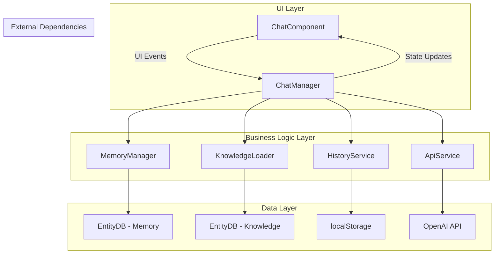
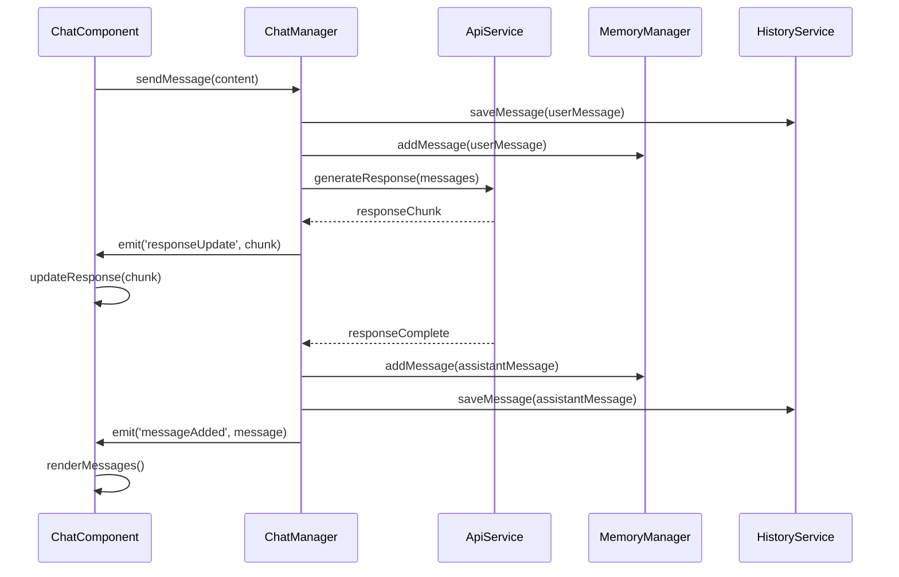

# Chat Component Refactoring Plan

## Overview

This document outlines the refactoring plan for `chat-component.js` to separate UI concerns from business logic by extracting non-UI elements (API calls, knowledge, memory, and history) into a dedicated library structure.

## Current Architecture Analysis

The current `ChatComponent` (2500+ lines) handles multiple concerns:
- **API Integration**: OpenAI API calls, streaming responses
- **Memory Management**: Using `MemoryManager` from `chat-component/lib/memory-manager.js`
- **Knowledge Base**: Using `KnowledgeLoader` from `chat-component/lib/knowledge-loader.js`
- **Chat History**: localStorage persistence, chat session management
- **UI Rendering**: DOM manipulation, event handling, theming
- **Configuration**: Model selection, theme management

## Proposed Architecture



## Refactoring Strategy

### Phase 1: Create ChatManager Class

**File**: `chat/lib/chat-manager.js`

**Responsibilities**:
- Coordinate all business logic operations
- Manage state and configuration
- Provide clean interface for UI component
- Handle initialization and lifecycle

**Key Methods**:
```javascript
class ChatManager extends EventTarget {
  // Initialization
  async initialize(config)
  
  // Message handling
  async sendMessage(content)
  async generateResponse(messages)
  
  // Chat management
  createNewChat()
  loadChat(chatId)
  deleteChat(chatId)
  getChatHistory()
  
  // Configuration
  setModel(modelId)
  setTheme(theme)
  getApiKey()
  setApiKey(key)
  
  // State management
  getMessages()
  isProcessing()
  isInitialized()
  
  // Event system
  on(event, callback)
  off(event, callback)
  emit(event, data)
}
```

### Phase 2: Extract API Service

**File**: `chat/lib/api-service.js`

**Extracted Methods from ChatComponent**:
- `getApiKey()` (lines 233-248)
- `fetchResumeData()` (lines 251-276)
- `loadKnowledgeBase()` (lines 279-324)
- `streamChatCompletion()` (lines 327-391)
- `createSystemPrompt()` (lines 479-559)

**Responsibilities**:
- OpenAI API integration
- Resume data fetching
- Knowledge base loading
- System prompt generation
- API key management

### Phase 3: Extract History Service

**File**: `chat/lib/history-service.js`

**Extracted Methods from ChatComponent**:
- `loadChatHistory()` (lines 1014-1024)
- `saveChatHistory()` (lines 1026-1053)
- `createNewChat()` (lines 1055-1080)
- `loadChat()` (lines 1082-1091)
- `deleteChat()` (lines 1093-1125)

**Responsibilities**:
- Chat session management
- localStorage persistence
- Chat history CRUD operations

### Phase 4: Refactor ChatComponent

**Simplified ChatComponent responsibilities**:
- DOM rendering and manipulation
- Event handling (clicks, form submissions)
- Theme application and styling
- Progress updates and loading states
- Message display and formatting

**Removed from ChatComponent**:
- All API calls and data fetching
- Memory and knowledge management
- Chat history persistence
- Business logic and state management

## Implementation Details

### ChatManager Structure
```javascript
// chat/lib/chat-manager.js
import { MemoryManager } from './memory-manager.js';
import { KnowledgeLoader } from './knowledge-loader.js';
import { ApiService } from './api-service.js';
import { HistoryService } from './history-service.js';

export class ChatManager extends EventTarget {
  constructor(config = {}) {
    super();
    this.config = config;
    this.state = {
      messages: [],
      isProcessing: false,
      isInitialized: false,
      currentChatId: null,
      selectedModel: config.model || "gpt-4o-mini"
    };
    
    // Initialize services
    this.apiService = new ApiService(config.api);
    this.historyService = new HistoryService(config.history);
    this.memoryManager = null;
    this.knowledgeLoader = null;
  }
  
  async initialize() {
    // Initialize API service
    await this.apiService.initialize();
    
    // Initialize memory and knowledge systems
    await this.initializeMemoryAndKnowledge();
    
    // Load chat history
    this.historyService.loadHistory();
    
    this.state.isInitialized = true;
    this.dispatchEvent(new CustomEvent('initialized'));
  }
}
```

### ApiService Structure
```javascript
// chat/lib/api-service.js
export class ApiService {
  constructor(config = {}) {
    this.apiKey = null;
    this.selectedModel = config.model || "gpt-4o-mini";
    this.resumeData = null;
    this.knowledgeBase = {};
    this.availableModels = [
      { id: "gpt-4o-mini", name: "GPT-4o Mini (Fast)" },
      { id: "gpt-4o", name: "GPT-4o (Smart)" }
    ];
  }
  
  async initialize() {
    this.apiKey = this.getApiKey();
    await this.fetchResumeData();
    await this.loadKnowledgeBase();
  }
  
  // All API-related methods moved here
}
```

### HistoryService Structure
```javascript
// chat/lib/history-service.js
export class HistoryService {
  constructor(config = {}) {
    this.storageKey = config.storageKey || 'chat-history';
    this.chatHistory = [];
    this.activeChat = null;
  }
  
  loadHistory() {
    try {
      const savedHistory = localStorage.getItem(this.storageKey);
      this.chatHistory = savedHistory ? JSON.parse(savedHistory) : [
        { id: 'default', name: 'New Chat', messages: [] }
      ];
      this.activeChat = this.chatHistory.length > 0 ? this.chatHistory[0].id : null;
    } catch (e) {
      console.error('Failed to load chat history:', e);
      this.chatHistory = [{ id: 'default', name: 'New Chat', messages: [] }];
    }
  }
  
  // All history-related methods moved here
}
```

### Updated ChatComponent Interface
```javascript
// chat/chat-component.js (simplified)
class ChatComponent extends HTMLElement {
  constructor() {
    super();
    this.attachShadow({ mode: 'open' });
    
    // Initialize ChatManager
    this.chatManager = new ChatManager({
      api: { 
        model: this.getAttribute('model') || 'gpt-4o-mini'
      },
      history: { 
        storageKey: 'chat-history' 
      }
    });
    
    // Setup event listeners for ChatManager events
    this.setupChatManagerListeners();
    
    // UI-only properties
    this.brand = this.getAttribute('brand') || 'att';
    this.theme = localStorage.getItem('chat-theme') || this.brand;
    this.defaultThemes = { /* theme configurations */ };
  }
  
  setupChatManagerListeners() {
    this.chatManager.addEventListener('messageAdded', (e) => {
      this.renderMessages();
    });
    
    this.chatManager.addEventListener('responseUpdate', (e) => {
      this.updateResponse(e.detail.content);
    });
    
    this.chatManager.addEventListener('stateChanged', (e) => {
      this.updateUI(e.detail.state);
    });
    
    this.chatManager.addEventListener('progressUpdate', (e) => {
      this.updateProgress(e.detail);
    });
  }
  
  async sendMessage(content) {
    await this.chatManager.sendMessage(content);
  }
  
  // Only UI-related methods remain
}
```

## Event-Driven Communication



## File Structure After Refactoring

```
chat/
├── chat-component.js (UI only, ~800 lines)
├── chat-component-refactoring-plan.md (this file)
└── lib/
    ├── chat-manager.js (Main business logic coordinator)
    ├── api-service.js (OpenAI API integration)
    ├── history-service.js (Chat history management)
    ├── memory-manager.js (Existing, enhanced)
    ├── knowledge-loader.js (Existing, enhanced)
    └── entity-db.js (Existing)
```

## Benefits of This Approach

1. **Separation of Concerns**: Clear distinction between UI and business logic
2. **Testability**: Business logic can be tested independently of UI
3. **Reusability**: ChatManager can be used in different UI contexts
4. **Maintainability**: Smaller, focused classes are easier to maintain
5. **Extensibility**: Easy to add new features without touching UI code
6. **Performance**: Better memory management and initialization control

## Migration Strategy

1. **Backward Compatibility**: Maintain existing public interface during transition
2. **Incremental Migration**: Move one service at a time to minimize risk
3. **Event System**: Use CustomEvents for loose coupling between layers
4. **Configuration**: Centralized configuration through ChatManager constructor
5. **Error Handling**: Consistent error handling and propagation across all services

## Implementation Steps

1. Create `ChatManager` class with basic structure
2. Extract and create `ApiService` class
3. Extract and create `HistoryService` class
4. Update `ChatComponent` to use `ChatManager`
5. Test each phase thoroughly
6. Update existing `MemoryManager` and `KnowledgeLoader` integration
7. Add comprehensive error handling and logging
8. Update documentation and examples

## Testing Strategy

- Unit tests for each service class
- Integration tests for ChatManager
- UI tests for ChatComponent
- End-to-end tests for complete workflows
- Performance tests for memory usage and response times

This refactoring will result in a more maintainable, testable, and extensible chat component architecture while preserving all existing functionality.