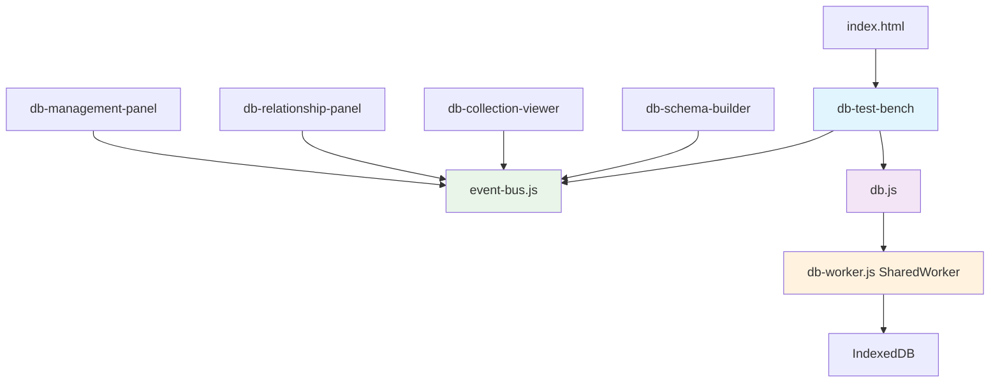
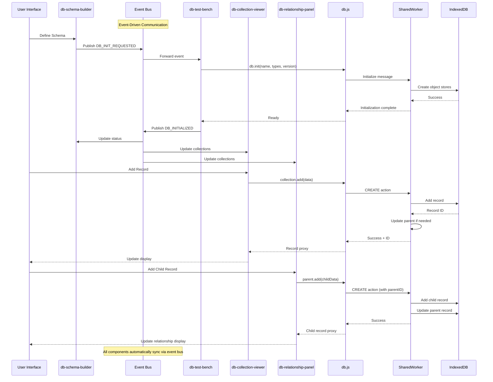

# DB Test Bench Web Component - Architectural Plan

## Overview
Create a comprehensive web component that fully utilizes the capabilities of `db.js`, focusing on demonstrating parent-child relationships, CRUD operations, schema management, and advanced database features through an intuitive UI.

## Project Structure
```
database/
├── index.html                    # Main entry point
├── db-test-bench.js             # Main web component
├── event-bus.js                 # Event bus for component communication
├── components/
│   ├── db-schema-builder.js     # Schema definition UI
│   ├── db-collection-viewer.js  # Data display and CRUD
│   ├── db-relationship-panel.js # Parent-child visualizer
│   └── db-management-panel.js   # Database lifecycle controls
├── db.js                        # Existing DB wrapper
├── db-worker.js                 # Existing SharedWorker
└── plan.md                      # This file
```

## Core Architecture

### Main Component: `db-test-bench`
A single web component that orchestrates all database testing functionality, following the existing project patterns.

**Key Features:**
1. **Schema Builder** - Visual interface to define database schema
2. **Collection Viewer** - Display and manage data with CRUD operations
3. **Relationship Visualizer** - Parent-child relationship demonstration
4. **Database Management** - Lifecycle controls (init, close, drop)
5. **Real-time Updates** - SharedWorker synchronization across tabs

## Component Architecture



## Event-Driven Architecture

The system now uses a **decentralized event bus pattern** for component communication, eliminating the central coordinator bottleneck and creating loose coupling between components.

### Event Bus System
- **Central event hub**: All components communicate through [`event-bus.js`](database/event-bus.js:1)
- **Publish/Subscribe pattern**: Components publish events and subscribe to relevant state changes
- **Loose coupling**: No direct dependencies between components
- **Automatic cleanup**: Event subscriptions are properly cleaned up in `disconnectedCallback()`

### Key Events
```javascript
EVENTS = {
    DB_INIT_REQUESTED: 'db:init-requested',
    DB_INITIALIZED: 'db:initialized',
    DB_INIT_FAILED: 'db:init-failed',
    DB_CLOSE_REQUESTED: 'db:close-requested',
    DB_CLOSED: 'db:closed',
    DB_DROP_REQUESTED: 'db:drop-requested',
    DB_DROPPED: 'db:dropped',
    WORKER_STATUS_CHANGED: 'worker:status-changed'
};
```

## Detailed Component Specifications

### 1. `db-test-bench` (Main Component)
**Purpose:** Layout manager and database operation handler

**Features:**
- Tabbed or panel-based layout
- Database instance management
- Event bus coordination for database operations
- Database lifecycle event publishing

**Event Bus Integration:**
- Subscribes to database operation requests
- Publishes database state changes
- Manages single `DB` instance
- Handles `db.init()`, `db.close()`, `db.drop()` operations

**Architecture Change:**
- **Before**: Direct method calls to child components
- **After**: Event-driven communication via event bus

### 2. `db-schema-builder`
**Purpose:** Visual schema definition and database initialization

**UI Elements:**
- Database name input (with session storage persistence)
- Collection name management (add/remove)
- Version number selector
- Initialize database button
- Schema validation feedback

**Features:**
- Dynamic collection list management
- Schema preview
- Validation before initialization
- Export/import schema as JSON
- Session storage for database name persistence

**Event Bus Integration:**
- **Publishes**: `EVENTS.DB_INIT_REQUESTED` with schema data
- **Subscribes to**:
  - `EVENTS.DB_INITIALIZED` - Success feedback
  - `EVENTS.DB_INIT_FAILED` - Error feedback
  - `EVENTS.DB_CLOSED` - Connection status updates
  - `EVENTS.DB_DROPPED` - Database state updates

**Architecture Change:**
- **Before**: Dispatched custom events to parent component
- **After**: Publishes standardized events via event bus

### 3. `db-collection-viewer`
**Purpose:** Data display and CRUD operations

**UI Elements:**
- Collection selector dropdown
- Data table with sortable columns
- Add record form
- Edit/Delete buttons per record
- Search/filter functionality
- Pagination for large datasets

**Features:**
- Real-time data updates
- Inline editing
- Bulk operations
- Record validation
- Export data as JSON/CSV
- Automatic collection synchronization

**Event Bus Integration:**
- **Subscribes to**:
  - `EVENTS.DB_INITIALIZED` - Auto-update collections and database instance
  - `EVENTS.DB_CLOSED` - Clear collections and database instance
  - `EVENTS.DB_DROPPED` - Reset component state

**API Integration:**
```javascript
// Display data
db[collection].forEach(record => {...})

// CRUD operations
await db[collection].add(data)
await db[collection].find(query)
await record.update()
await record.remove()
```

**Architecture Change:**
- **Before**: Manually updated via direct method calls from test bench
- **After**: Automatically updates via event bus subscriptions

### 4. `db-relationship-panel`
**Purpose:** Parent-child relationship visualization and testing

**UI Layout:**
```
┌─────────────────┬─────────────────────────────┐
│ Parent Records  │ Selected Parent Details     │
│                 │ ┌─────────────────────────┐ │
│ □ Post 1        │ │ ID: 2                   │ │
│ ■ Post 2        │ │ Title: My Second Post   │ │
│ □ Post 3        │ │ Content: ...            │ │
│                 │ └─────────────────────────┘ │
│                 │                             │
│                 │ Child Records (Comments):   │
│                 │ • Comment A: "Great!"      │
│                 │ • Comment B: "I agree"     │
│                 │                             │
│                 │ Add Child:                  │
│                 │ [Text Input____________]    │
│                 │ [Add Comment Button]        │
└─────────────────┴─────────────────────────────┘
```

**Features:**
- Two-panel layout (parent list + details)
- Visual parent-child relationship display
- Add child records via proxy methods
- Automatic relationship linking
- Nested relationship support
- Automatic collection synchronization

**Event Bus Integration:**
- **Subscribes to**:
  - `EVENTS.DB_INITIALIZED` - Auto-update collections and database instance
  - `EVENTS.DB_CLOSED` - Clear collections and database instance
  - `EVENTS.DB_DROPPED` - Reset component state

**API Integration:**
```javascript
// Using record proxy methods
await selectedParent.add({
  type: 'comments',
  text: 'New comment content'
})
```

**Architecture Change:**
- **Before**: Manually updated via direct method calls from test bench
- **After**: Automatically updates via event bus subscriptions

### 5. `db-management-panel`
**Purpose:** Database lifecycle and advanced operations

**UI Elements:**
- Connection status indicator
- Close connection button
- Drop database button
- Worker status display
- Database statistics
- Multi-tab sync demonstration

**Features:**
- Real-time connection monitoring
- Safe database operations with confirmations
- SharedWorker status tracking
- Cross-tab synchronization demo

**API Integration:**
```javascript
await db.close()
await db.drop()
db.isWorkerRunning()
```

## Data Flow Architecture (Event-Driven)



## Advanced Features to Showcase db.js Capabilities

### 1. Record Proxy Demonstration
- Interactive buttons showing `record.update()`, `record.remove()`, `record.add()`
- Visual feedback for proxy method calls
- Before/after state comparison

### 2. Parent-Child Relationship Testing
- Automatic `parentID` and `parentType` assignment
- Visual relationship tree
- Cascading operations demonstration

### 3. SharedWorker Multi-Tab Sync
- Instructions for opening multiple tabs
- Real-time synchronization demonstration
- Connection status across tabs

### 4. Transaction and Batch Operations
- Bulk data import/export
- Transaction rollback demonstration
- Performance testing with large datasets

### 5. Schema Evolution Testing
- Version upgrade simulation
- Migration testing interface
- Backward compatibility checks

## Implementation Strategy

### ✅ Phase 1: Core Infrastructure (COMPLETED)
1. ✅ Create main `db-test-bench` component with basic layout
2. ✅ Implement `db-schema-builder` for database initialization
3. ✅ Basic `db-collection-viewer` with CRUD operations

### ✅ Phase 2: Relationship Features (COMPLETED)
1. ✅ Implement `db-relationship-panel` with parent-child visualization
2. ✅ Add record proxy method demonstrations
3. ✅ Parent-child relationship creation and management

### ✅ Phase 3: Event-Driven Architecture (COMPLETED)
1. ✅ **MAJOR REFACTOR**: Implemented decentralized event bus pattern
2. ✅ **Event Bus System**: Created [`event-bus.js`](database/event-bus.js:1) with publish/subscribe pattern
3. ✅ **Component Refactoring**: Updated all components to use event bus communication
4. ✅ **Loose Coupling**: Eliminated direct dependencies between components
5. ✅ **Session Storage**: Added database name persistence functionality

### Phase 4: Advanced Features
1. Add `db-management-panel` with lifecycle controls
2. Implement multi-tab synchronization demo
3. Add data import/export capabilities

### Phase 5: Polish and Testing
1. Add comprehensive error handling
2. Implement responsive design
3. Add help documentation and tooltips
4. Performance optimization

## ✅ Recent Architectural Improvements (COMPLETED)

### Event-Driven Architecture Implementation
- **Decentralized Communication**: Components now communicate through event bus instead of central routing
- **Event Bus Pattern**: Implemented publish/subscribe system with standardized events
- **Component Independence**: Each component manages its own state and responds to relevant events
- **Memory Management**: Proper event subscription cleanup in `disconnectedCallback()` methods
- **Scalability**: New components can easily integrate without modifying existing code

### Refactored Components
- **[`db-test-bench.js`](database/db-test-bench.js:1)**: Now uses event bus subscriptions instead of direct component calls
- **[`db-schema-builder.js`](database/components/db-schema-builder.js:1)**: Publishes `DB_INIT_REQUESTED` events and subscribes to database state changes
- **[`db-collection-viewer.js`](database/components/db-collection-viewer.js:1)**: Automatically updates collections via event subscriptions
- **[`db-relationship-panel.js`](database/components/db-relationship-panel.js:1)**: Automatically syncs with database state changes

### Benefits Achieved
- **Enhanced Maintainability**: Clear separation of concerns with no tight coupling
- **Improved Scalability**: Easy to add new components without affecting existing ones
- **Better Testability**: Components can be tested in isolation
- **Consistent Communication**: Standardized event patterns across all components

## Technical Considerations

### Error Handling
- Graceful degradation for unsupported browsers
- Clear error messages for database operations
- Validation feedback for user inputs

### Performance
- Lazy loading of large datasets
- Pagination for data tables
- Debounced search and filter operations

### Accessibility
- Keyboard navigation support
- Screen reader compatibility
- High contrast mode support

### Browser Compatibility
- Modern browser support (ES6+ features)
- SharedWorker support detection
- IndexedDB availability checks

## File Dependencies
- No external dependencies beyond existing `db.js` and `db-worker.js`
- Self-contained CSS styling
- Modular component architecture for maintainability

## Testing Strategy
- Component isolation testing
- Database operation validation
- Multi-tab synchronization verification
- Performance benchmarking with various data sizes
- Error condition handling verification

This architecture provides a comprehensive testing environment for all `db.js` capabilities while maintaining clean separation of concerns and following established project patterns.