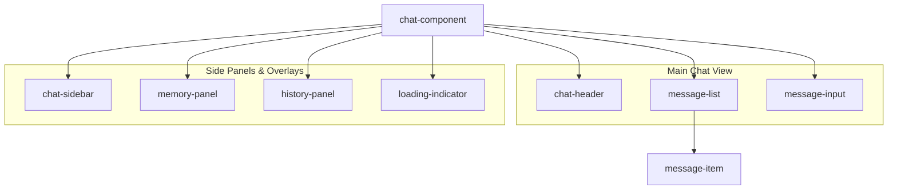

# Chat Component Refactoring Plan

## Proposed UI Architecture

The goal is to decompose the monolithic `ChatComponent` into a set of smaller, focused web components. Each new component will be responsible for a distinct part of the UI, making the system more modular and easier to develop and maintain.

### Component Breakdown

1.  **`chat-component` (The Container):** This will remain as the main component (`refactored-chat-component.js`). It will be responsible for:
    *   Managing the `ChatManager` instance.
    *   Holding the application state (e.g., messages, current theme, active chat).
    *   Orchestrating the data flow between the new child components.

2.  **`chat-header`:** A stateless component to display the header of the chat window.
    *   **Responsibility:** Shows the chat title, status, and action buttons (Memory, History, Theme, Close).
    *   **File:** `chat/components/chat-header.js`

3.  **`message-list`:** Displays the scrollable list of chat messages.
    *   **Responsibility:** Renders a list of `message-item` components.
    *   **File:** `chat/components/message-list.js`

4.  **`message-item`:** Renders a single message from either the user or the assistant.
    *   **Responsibility:** Displays the avatar, message content, timestamp, and action buttons (Copy, Feedback).
    *   **File:** `chat/components/message-item.js`

5.  **`message-input`:** The form for composing and sending messages.
    *   **Responsibility:** Handles user input, file attachments, and the send button.
    *   **File:** `chat/components/message-input.js`

6.  **`chat-sidebar`:** The collapsible sidebar for navigating chat history.
    *   **Responsibility:** Displays the list of past conversations and a "New Chat" button.
    *   **File:** `chat/components/chat-sidebar.js`

7.  **`memory-panel`:** The slide-out panel that displays the AI's memory and knowledge context.
    *   **Responsibility:** Shows contextual information being used by the AI.
    *   **File:** `chat/components/memory-panel.js`

8.  **`history-panel`:** The slide-out panel for viewing and managing chat history.
    *   **Responsibility:** A more detailed view of chat history than the sidebar.
    *   **File:** `chat/components/history-panel.js`

9.  **`loading-indicator`:** The initial loading screen.
    *   **Responsibility:** Provides feedback to the user while the AI model is initializing.
    *   **File:** `chat/components/loading-indicator.js`

### Component Hierarchy



### Data Flow Strategy

The communication between components will follow a standard pattern for web components:

*   **State Management:** The main `chat-component` will remain the "single source of truth." It will manage the application state and the `ChatManager`.
*   **Properties (Props) Down:** The `chat-component` will pass data down to its child components via HTML attributes/properties. For example, it will pass the array of messages to the `message-list` component.
*   **Custom Events Up:** When a user interacts with a child component, that component will dispatch a custom event, which the `chat-component` will listen for. For example, when the user clicks "send," the `message-input` component will dispatch a `sendMessage` event with the message content.

### Proposed File Structure

```
chat/
├── components/
│   ├── chat-header.js
│   ├── chat-sidebar.js
│   ├── history-panel.js
│   ├── loading-indicator.js
│   ├── memory-panel.js
│   ├── message-input.js
│   ├── message-item.js
│   └── message-list.js
├── lib/
│   └── chat-manager.js
├── knowledge/
│   └── ...
├── refactored-chat-component.js  // This will be refactored to be the container
└── index.html
```

### Mobile Responsiveness

Each component will be designed with a mobile-first approach. The styles will be encapsulated within each component's Shadow DOM. We will use CSS media queries to ensure the layout and controls adapt gracefully to different screen sizes, from small mobile devices to large desktop screens. The main `chat-component` will manage the responsive behavior of the overall layout, such as toggling the sidebar's visibility on mobile.