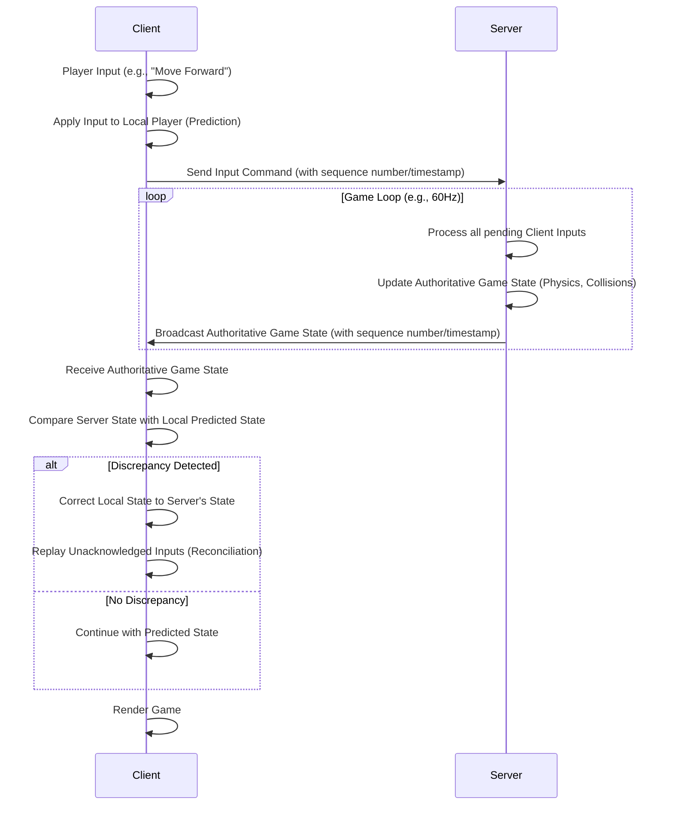

# Multiplayer Game Client Synchronization Plan (Revised: Event-Driven & Generic)

This document outlines a detailed plan for implementing a flexible, event-driven client-server synchronization system capable of supporting both real-time (e.g., Asteroids) and turn-based (e.g., Hold'em) multiplayer games, ensuring consistent and responsive gameplay.

## Goal

Implement a flexible, event-driven client-server synchronization system capable of supporting both real-time (e.g., Asteroids) and turn-based (e.g., Hold'em) multiplayer games, ensuring consistent and responsive gameplay.

## Key Technologies

*   **Backend:** Deno 2 (for WebSocket server, game logic, and event broadcasting, located in `/server/`)
*   **Frontend:** Standard Browser APIs (for WebSocket client and game rendering/logic, with reusable JS in `/js/`)

## Core Principles

*   **Server Authoritative:** The Deno backend remains the single source of truth. All game logic and state transitions occur on the server.
*   **Event-Driven Communication:** All game updates, whether from client inputs or server-side logic, will be communicated as discrete, typed events over WebSockets.
*   **Game Room Abstraction:** The server will manage distinct "game rooms" or "lobbies." Clients will connect to a specific room, and events will be broadcast only to clients within that room. This naturally separates game instances.
*   **Client-Side Simulation (for Real-time):** For real-time games, clients will still perform client-side prediction for their own actions and interpolate/extrapolate for other entities based on received events. Reconciliation will involve correcting the client's local simulation based on authoritative server events.
*   **Client-Side Reaction (for Turn-based):** For turn-based games, clients will primarily react to server-broadcasted events, updating their UI and local state as turns progress. Prediction is generally not needed.

---

## Detailed Plan

### Phase 1: Backend (Deno) Implementation (`/server/`)

1.  **Centralized Game Manager (`GameManager` class):**
    *   Introduce a `GameManager` class responsible for:
        *   Managing multiple `GameRoom` instances.
        *   Handling new WebSocket connections and assigning them to specific game rooms (e.g., based on URL path or initial message).
        *   Routing incoming client events to the correct `GameRoom`.
        *   Broadcasting game events from `GameRoom`s to their respective connected clients.

2.  **Game Room Abstraction (`GameRoom` class):**
    *   Each `GameRoom` instance will represent a single game session (e.g., one Asteroids match, one Hold'em table).
    *   It will encapsulate the specific game logic and state for that game type (e.g., `AsteroidsGameLogic`, `HoldemGameLogic`).
    *   It will manage the WebSocket connections for players within that room.
    *   It will have a method to process incoming client events and a method to broadcast outgoing game events to its players.

3.  **Generic Event Structure (`types.ts` update):**
    *   Define a common `GameEvent` interface that includes:
        *   `type`: A string identifying the event (e.g., `'playerMoved'`, `'bulletFired'`, `'cardDealt'`, `'playerFolded'`).
        *   `payload`: A flexible object containing event-specific data.
        *   `senderId`: The ID of the client or server that initiated the event.
        *   `timestamp`: Server timestamp for event ordering.
        *   `sequenceNumber` (optional, for client-side prediction/reconciliation in real-time games).
    *   Define `ClientInputEvent` and `ServerGameEvent` to distinguish direction.

4.  **Game Logic Modules (e.g., `asteroids_logic.ts`, `holdem_logic.ts`):**
    *   These modules will contain the specific rules, physics, and state management for each game type.
    *   They will receive `ClientInputEvent`s, update their internal game state, and emit `ServerGameEvent`s.
    *   For real-time games, a fixed-tick game loop will process inputs and generate events. For turn-based games, events will be generated on discrete player actions.

5.  **WebSocket Server Integration (`main.ts` update):**
    *   Modify `main.ts` to instantiate the `GameManager`.
    *   Handle WebSocket upgrade requests, passing the new socket and a unique player ID to the `GameManager`.
    *   The `GameManager` will then decide which `GameRoom` to assign the player to (e.g., `/game/asteroids` vs. `/game/holdem`).

---

### Phase 2: Frontend (Browser) Implementation (`/js/`)

1.  **Generic Multiplayer Client (`multiplayer-client.js` update):**
    *   Refactor `MultiplayerClient` to be more generic, focusing on WebSocket connection management and event sending/receiving.
    *   It will connect to a specific game room URL (e.g., `ws://localhost:8081/game/asteroids`).
    *   It will provide methods to `sendEvent(eventType, payload)` and register `onEvent(eventType, callback)` listeners.
    *   It will no longer directly manage `gameState` but rather pass received `ServerGameEvent`s to the game-specific logic.

2.  **Game-Specific Client Logic (e.g., `asteroids_client.js`, `holdem_client.js`):**
    *   These modules will import and use the generic `MultiplayerClient`.
    *   They will contain the game's rendering logic and local state management.
    *   **For Asteroids:**
        *   It will listen for `playerMoved`, `bulletFired`, `asteroidDestroyed` events.
        *   It will still implement client-side prediction for the local player's movement based on its own inputs.
        *   It will reconcile its local player's state based on authoritative `playerStateUpdate` events (or similar) from the server, which might be sent periodically or as a result of specific actions.
        *   It will interpolate/extrapolate other entities based on their respective events.
    *   **For Hold'em:**
        *   It will listen for events like `cardDealt`, `playerBet`, `turnEnded`, `gameEnded`.
        *   It will update the UI and local game state purely based on these authoritative server events. No prediction/reconciliation is needed.

---

### Phase 3: Optimization & Refinements (Iterative)

1.  **Event Design:**
    *   Carefully design event types and their payloads to be as minimal and descriptive as possible.
    *   Consider using a common event schema for validation.
2.  **Serialization:**
    *   Start with JSON for events. If event volume or payload size becomes an issue, consider MessagePack for binary event serialization.
3.  **Reliability & Ordering:**
    *   For critical events (especially in turn-based games), ensure reliable delivery and correct ordering. WebSockets inherently provide ordered delivery, but application-level sequence numbers can add robustness.
4.  **Latency Compensation (Real-time):**
    *   The existing client-side prediction and reconciliation techniques remain crucial for real-time games, adapted to work with event streams.
5.  **Room Management UI:**
    *   Consider how players will discover and join game rooms (e.g., a simple lobby page).

---

## Architectural Diagram (Event-Driven)

```mermaid
graph TD
    subgraph Client (Browser)
        CGL[Game-Specific Logic & Rendering] --> |Sends Client Events| MPC(MultiplayerClient)
        MPC --> |Receives Server Events| CGL
        CGL --> CP(Client-Side Prediction - Real-time Only)
    end

    subgraph Server (Deno Backend)
        WS_S(WebSocket Server) --> GM(GameManager)
        GM --> |Routes Events| GR(GameRoom Instances)
        GR --> |Game Logic & State| GLM(Game Logic Modules: Asteroids, Hold'em)
        GLM --> |Emits Server Events| GR
        GR --> |Broadcasts Events| GM
    end

    MPC <--> |WebSocket Connection| WS_S

    style CGL fill:#f9f,stroke:#333,stroke-width:2px
    style MPC fill:#ccf,stroke:#333,stroke-width:2px
    style CP fill:#fcf,stroke:#333,stroke-width:2px
    style WS_S fill:#ccf,stroke:#333,stroke-width:2px
    style GM fill:#9cf,stroke:#333,stroke-width:2px
    style GR fill:#9ff,stroke:#333,stroke-width:2px
    style GLM fill:#f9c,stroke:#333,stroke-width:2px
```

---

## Detailed Explanation: Client-Side Prediction and Reconciliation

### Client-Side Prediction

**What it is:**
Client-side prediction is a technique where the client immediately simulates the effects of its own actions without waiting for confirmation from the server. When a player presses a key to move their ship, the client updates the ship's position on the screen *instantly*.

**Why it's important:**
*   **Responsiveness:** It eliminates the perceived lag between a player's input and the visual feedback on their screen. Without it, players would experience a noticeable delay (equal to their round-trip time to the server) every time they moved or fired, making the game feel sluggish and unresponsive.
*   **Smoothness:** It helps maintain a consistent frame rate and smooth animation, as the client isn't constantly waiting for server updates to render its own player's movement.

**How it works (simplified):**
1.  **Input:** The client captures a player's input (e.g., "move forward").
2.  **Prediction:** The client immediately applies this input to its local simulation of the player's ship, updating its position, velocity, and orientation.
3.  **Send Input:** The client sends this input command to the server.
4.  **Render:** The client renders the game state, including the predicted movement of its own ship.

### Reconciliation (or Server Reconciliation/Correction)

**What it is:**
Reconciliation is the process of correcting the client's predicted state with the authoritative state received from the server. Since the server is the ultimate source of truth, the client must eventually align its view of the game with what the server dictates.

**Why it's important:**
*   **Authoritativeness:** Ensures that all clients eventually agree on the true game state, preventing desynchronization and potential cheating.
*   **Fairness:** Resolves conflicts that arise from network latency (e.g., two players firing at the same time, but one's shot registers first on the server).
*   **Consistency:** Guarantees that the game logic (e.g., collision detection, scoring) is consistently applied across all clients based on the server's calculations.

**How it works (simplified):**
1.  **Server Update:** The server processes the client's input (and inputs from all other clients), updates its authoritative game state, and sends this updated state back to the client. This update typically includes a timestamp or a sequence number corresponding to the inputs it has processed.
2.  **Receive Update:** The client receives the authoritative game state from the server.
3.  **Compare:** The client compares the received authoritative state for its own player with its current predicted local state.
4.  **Replay/Correct:**
    *   If the server's state matches the client's prediction, no correction is needed.
    *   If there's a discrepancy (e.g., due to network jitter, packet loss, or server-side physics differences), the client "snaps" its player's position to the server's authoritative position.
    *   To make this correction smooth, the client might "replay" any inputs it has processed *since* the server's acknowledged state, applying them to the newly received authoritative state. This helps to smoothly transition the client's view without jarring jumps.

### Putting it Together: The Flow



### Key Considerations for Implementation:

*   **Input Buffering:** On the client, you'll need to store a history of inputs sent to the server, along with the predicted state at the time those inputs were applied. This history is crucial for replaying inputs during reconciliation.
*   **State Snapshots:** The server sends snapshots of the game state. These snapshots should be as compact as possible to minimize bandwidth.
*   **Interpolation/Extrapolation for Other Entities:** While prediction/reconciliation is for the *local* player, other players and entities (asteroids, bullets) will also need smooth movement. This is typically achieved by interpolating their positions between received server updates. If a new update hasn't arrived, you might extrapolate their position based on their last known velocity.
*   **Jitter Buffering:** Clients can implement a small buffer to smooth out network jitter, ensuring a consistent rate of updates to the game logic.
*   **Latency Simulation (for testing):** When developing, it's invaluable to simulate network latency to properly test your prediction and reconciliation logic.

---

## Detailed Explanation: Data Serialization Options

The goal is to convert your game state (player positions, velocities, bullet states, etc.) into a format that can be sent efficiently over the network and then quickly converted back into usable data on the receiving end.

#### 1. JSON (JavaScript Object Notation)

*   **Description:** A human-readable, text-based format widely used for data interchange. It's native to JavaScript, making it very easy to work with in the browser and Deno.
*   **Pros:**
    *   **Simplicity:** Extremely easy to implement and debug. Deno and browsers have built-in `JSON.stringify()` and `JSON.parse()` methods.
    *   **Human-readable:** Easy to inspect and understand the data being sent, which is great for development and debugging.
    *   **Widely supported:** No external libraries are needed for basic usage in Deno or the browser.
*   **Cons:**
    *   **Verbosity:** Text-based formats are generally larger than binary formats because they include key names, whitespace, and string representations of numbers. For 60 updates/second, this can add up quickly.
    *   **Parsing Overhead:** While fast, parsing text can be slower than parsing binary data, especially for large payloads.
*   **When to use:**
    *   **Initial Development:** Start with JSON. It's the quickest way to get something working and debug your game state.
    *   **Low Player Count / Simple State:** If your game state is relatively small and the number of concurrent players is low, JSON might be sufficient.
    *   **Input Commands:** For client inputs (e.g., "move forward"), JSON is often perfectly fine as these messages are typically small.

#### 2. Binary Formats (e.g., MessagePack, FlatBuffers, Protocol Buffers)

These formats encode data into a compact binary representation, significantly reducing message size and often improving parsing performance. They require a schema definition and libraries for encoding/decoding.

*   **MessagePack:**
    *   **Description:** A binary serialization format that's more compact than JSON but still relatively easy to use. It's often called "binary JSON."
    *   **Pros:**
        *   **Compactness:** Much smaller message sizes than JSON.
        *   **Speed:** Faster encoding and decoding than JSON.
        *   **Schema-less (mostly):** Doesn't strictly require a predefined schema, making it more flexible than Protocol Buffers or FlatBuffers, though defining your data structure is still good practice.
    *   **Cons:**
        *   **Not human-readable:** You'll need a MessagePack decoder to inspect the raw data.
        *   **Library Dependency:** Requires a MessagePack library on both Deno and the browser.
    *   **When to use:**
        *   When JSON becomes a bottleneck due to bandwidth or parsing speed, but you want to avoid the complexity of strict schema-based formats. It's a good "next step" optimization.

*   **Protocol Buffers (Protobuf):**
    *   **Description:** A language-neutral, platform-neutral, extensible mechanism for serializing structured data. You define your data structure in a `.proto` file, and then use a `protoc` compiler to generate code for various languages (including TypeScript/JavaScript for Deno and browser).
    *   **Pros:**
        *   **Extreme Compactness:** Highly optimized for size.
        *   **Performance:** Very fast encoding and decoding.
        *   **Schema Enforcement:** The schema ensures data consistency and makes it easy to evolve your data structures over time.
        *   **Language Agnostic:** Great for multi-language environments.
    *   **Cons:**
        *   **Complexity:** Requires defining `.proto` files and using a code generator. This adds a build step and more upfront work.
        *   **Not human-readable:** Binary format.
        *   **Strict Schema:** Changes to the schema need careful management to maintain backward/forward compatibility.
    *   **When to use:**
        *   For high-performance, high-scale applications where every byte and millisecond counts. If your game becomes very popular and you need to optimize heavily, Protobuf is a strong contender.

*   **FlatBuffers:**
    *   **Description:** A serialization library for games and other memory-constrained apps. It allows you to access serialized data directly without parsing/unpacking it first, which can be extremely fast.
    *   **Pros:**
        *   **Zero-copy deserialization:** Data can be read directly from the buffer, avoiding memory allocations and copying. This is its main advantage for performance.
        *   **Compactness:** Very efficient.
    *   **Cons:**
        *   **Complexity:** Even more complex to use than Protocol Buffers, especially for beginners.
        *   **Schema-based:** Requires `.fbs` schema files and code generation.
    *   **When to use:**
        *   If you hit extreme performance bottlenecks with other formats, particularly related to deserialization speed and memory usage. Less common for typical browser-based games unless they are very complex.

#### 3. Custom Binary Format

*   **Description:** You define your own byte-level encoding scheme. For example, a player's X position could be a 2-byte integer, Y position another 2-byte integer, etc.
*   **Pros:**
    *   **Maximum Control & Compactness:** You can tailor the format precisely to your data, achieving the absolute smallest possible message size.
    *   **Potentially Fastest:** If implemented correctly, can be extremely fast to encode/decode.
*   **Cons:**
    *   **Highest Complexity:** Requires meticulous byte-level manipulation (e.g., using `DataView` or `Uint8Array` in JavaScript/TypeScript).
    *   **Error-prone:** Easy to make mistakes with byte offsets and data types.
    *   **Maintenance Nightmare:** Very difficult to debug and evolve the format.
*   **When to use:**
    *   Only as a last resort if all other optimized binary formats prove insufficient, and you have a deep understanding of network protocols and binary data. This is rarely necessary for most browser games.

#### 4. Delta Compression / State Differencing

*   **Description:** Instead of sending the entire game state, you only send the *changes* (deltas) from the previous state. This can be combined with any of the above serialization formats.
*   **Pros:**
    *   **Significant Bandwidth Savings:** If only a small portion of the game state changes between updates, this can drastically reduce message size.
*   **Cons:**
    *   **Complexity:** Requires tracking the previous state on both client and server, calculating diffs, and handling potential out-of-order or lost delta messages.
    *   **Full State Sync:** Periodically, you'll still need to send a full game state snapshot to ensure clients don't drift too far out of sync due to lost deltas.
*   **When to use:**
    *   As an advanced optimization *after* you've chosen a base serialization format (JSON, MessagePack, etc.) and identified bandwidth as a primary bottleneck.

### Recommendation for Your Asteroids Game:

1.  **Start with JSON:** It's the easiest to implement and debug. Get your core game loop, WebSocket communication, and basic prediction/reconciliation working first.
2.  **Profile and Optimize:** Once you have a working prototype, use browser developer tools and Deno's profiling capabilities to identify bottlenecks.
    *   If network bandwidth is the issue (large JSON messages), consider **MessagePack**.
    *   If CPU usage for parsing is the issue, or if you need even greater compactness, then **Protocol Buffers** would be the next logical step.
3.  **Consider Delta Compression Later:** If, after optimizing your base serialization, you still find bandwidth to be a major constraint, then explore delta compression.

This iterative approach allows you to build quickly and optimize only where necessary, avoiding premature optimization.

---

## Detailed Explanation: Generic Game Management and Routing

The key is to separate the *management of game sessions* from the *specific game logic*. The `GameManager` will be generic, focusing on connection handling and routing, while the `GameRoom` will dynamically load or delegate to the appropriate game logic based on client input.

#### 1. Client-Initiated Game Session

Instead of the server pre-configuring game types, the client will initiate the type of game it wants to play and, optionally, the specific room it wants to join. This will happen during the WebSocket connection or as the first message after connection.

*   **WebSocket URL Path:** The simplest way to signal the game type is through the WebSocket URL path.
    *   For Asteroids: `ws://localhost:8081/game/asteroids`
    *   For Hold'em: `ws://localhost:8081/game/holdem`
    *   This allows the `main.ts` server to quickly identify the intended game type.
*   **Initial Connection Message:** Alternatively, after establishing a generic WebSocket connection (e.g., `ws://localhost:8081/game`), the client could send an initial message like:
    ```json
    {
      "type": "joinGame",
      "gameType": "asteroids",
      "roomId": "myAsteroidsMatch123" // Optional: client can request a specific room
    }
    ```
    The plan will proceed with the URL path approach for simplicity in the initial implementation, as it's a common pattern.

#### 2. GameManager's Role in Routing

The `GameManager` will be responsible for:

*   **Receiving New Connections:** When `main.ts` upgrades a WebSocket connection, it passes the socket and the extracted `gameType` (from the URL path) and `playerId` to the `GameManager`.
*   **Managing GameRoom Instances:** The `GameManager` will maintain a collection (e.g., a `Map`) of active `GameRoom` instances, keyed by a combination of `gameType` and `roomId`.
*   **Dynamic Room Creation/Joining:**
    1.  When a new connection arrives, the `GameManager` checks if a `GameRoom` for the specified `gameType` and `roomId` (if provided, otherwise a default/new room) already exists.
    2.  If it exists, the player is added to that `GameRoom`.
    3.  If it doesn't exist, the `GameManager` dynamically creates a *new* `GameRoom` instance, passing the `gameType` to it. This new `GameRoom` is then added to the `GameManager`'s collection, and the player is added to it.

#### 3. GameRoom's Generic Nature and Delegation

This is where the "generic" server-side implementation for synchronization comes into play.

*   **Generic GameRoom:** The `GameRoom` itself will be a generic class. It won't contain hardcoded game logic for Asteroids or Hold'em. Instead, its primary responsibilities will be:
    *   Managing the WebSocket connections of players *within that specific room*.
    *   Receiving `ClientInputEvent`s from its players.
    *   **Delegating to Game Logic:** Crucially, the `GameRoom` will *delegate* the actual game state updates and event generation to a separate, game-specific logic module. This delegation happens based on the `gameType` it was initialized with.
    *   Broadcasting `ServerGameEvent`s to all connected clients in its room.

*   **Dynamic Game Logic Loading/Delegation:**
    *   When a `GameRoom` is instantiated with a `gameType` (e.g., "asteroids"), it will internally instantiate or reference the corresponding game logic module (e.g., `AsteroidsGameLogic`).
    *   This means the server *does* have the game logic modules (e.g., `asteroids_logic.ts`, `holdem_logic.ts`) available, but the `GameManager` doesn't need to know about them directly. The `GameRoom` acts as the intermediary.

#### Architectural Flow with Dynamic Game Logic

```mermaid
sequenceDiagram
    participant Client
    participant MainServer[main.ts]
    participant GameManager
    participant GameRoom
    participant GameLogic[e.g., asteroids_logic.ts]

    Client->>MainServer: WebSocket Upgrade Request (e.g., /game/asteroids)
    MainServer->>GameManager: newConnection(socket, "asteroids", playerId)

    alt GameRoom for "asteroids" exists
        GameManager->>GameRoom: addPlayer(socket, playerId)
    else GameRoom for "asteroids" does not exist
        GameManager->>GameRoom: new GameRoom("asteroids")
        GameRoom->>GameLogic: new AsteroidsGameLogic()
        GameManager->>GameRoom: addPlayer(socket, playerId)
    end

    loop Game Session
        Client->>GameRoom: ClientInputEvent (via WebSocket)
        GameRoom->>GameLogic: processInput(playerId, event)
        GameLogic->>GameLogic: Update Game State
        GameLogic->>GameRoom: emitServerEvent(eventData)
        GameRoom->>Client: ServerGameEvent (broadcast to all in room)
    end
```

#### Addressing "Client Defined Games" and "Generic Server"

*   **Client Defined Games:** The client *defines* which game it wants to play by specifying the `gameType` (e.g., in the URL path). The server doesn't need a pre-configured list of active games; it reacts to client requests.
*   **Generic Server:** The `main.ts` and `GameManager` remain generic. They don't contain game-specific logic. Their role is to establish connections, route them to the correct `GameRoom`, and facilitate event flow. The `GameRoom` itself is generic in its *interface* (it handles `GameEvent`s), but it *delegates* to a specific game logic module that it instantiates based on the `gameType`. This allows the server to be authoritative and enforce game rules without being tightly coupled to any single game's implementation details at the highest level.

---

## Detailed Explanation: Generic Event Structure and Payloads

The core idea is to have a standardized message format that all clients and the server understand, regardless of the specific game being played. This format will include metadata common to all events and a flexible `payload` field for game-specific data.

#### 1. The Core `GameEvent` Interface

We'll define a base interface that all game events will adhere to. This ensures consistency and allows the `MultiplayerClient` and `GameRoom` to handle events generically.

```typescript
// server/src/types.ts (or a new common_types.ts if preferred)

/**
 * Base interface for all game-related events.
 * This structure allows for generic handling of messages across different game types.
 */
export interface GameEvent {
  /**
   * A unique identifier for the event type (e.g., 'playerMoved', 'cardDealt', 'chatMessage').
   * This is crucial for routing and processing events on both client and server.
   */
  type: string;

  /**
   * The ID of the player or entity that initiated this event.
   * For server-generated events, this might be 'server' or the ID of the player whose action caused the event.
   */
  senderId: string;

  /**
   * A server-generated timestamp (milliseconds since epoch) when the event was processed/generated on the server.
   * Useful for ordering events and for client-side interpolation/reconciliation.
   */
  timestamp: number;

  /**
   * An optional sequence number, primarily used for client-side prediction and reconciliation
   * in real-time games to track acknowledged inputs.
   */
  sequenceNumber?: number;

  /**
   * The actual game-specific data for this event.
   * This is a flexible object whose structure depends entirely on the `type` of the event.
   */
  payload: any; // Use 'any' or a more specific type if using discriminated unions
}

// To distinguish client inputs from server broadcasts, we can use specific types:
export interface ClientInputEvent extends GameEvent {
  // Client inputs might have additional client-specific metadata if needed
}

export interface ServerGameEvent extends GameEvent {
  // Server events might have additional server-specific metadata if needed
}
```

#### 2. Designing Event Payloads for Different Game Types

The `payload` field is where the game-specific details reside. The structure of `payload` will vary greatly depending on the `type` of the event.

**A. Real-time Game Events (e.g., Asteroids)**

For real-time games, events will often represent continuous actions or frequent state changes.

*   **Client Input Events:**
    *   `type: 'playerInput'`
        *   `payload: { inputType: 'move', direction: 'forward', sequence: 123 }`
        *   `payload: { inputType: 'rotate', rotation: 'left', sequence: 124 }`
        *   `payload: { inputType: 'fire', sequence: 125 }`
        *   *Note:* The `sequenceNumber` is critical here for client-side prediction and reconciliation.

*   **Server Game Events (for broadcasting):**
    *   `type: 'playerStateUpdate'` (or `gameStateUpdate` if sending full snapshots, but we're moving away from that)
        *   `payload: { playerId: 'p1', position: {x: 100, y: 200}, velocity: {x: 5, y: 10}, rotation: 1.5, health: 80, lastInputSequence: 125 }`
        *   *Note:* This event would be sent frequently (e.g., 60 times/sec) for each player.
    *   `type: 'bulletSpawned'`
        *   `payload: { bulletId: 'b1', ownerId: 'p1', position: {x: 105, y: 205}, velocity: {x: 50, y: 100} }`
    *   `type: 'asteroidDestroyed'`
        *   `payload: { asteroidId: 'a1', newAsteroids: [{id: 'a2', ...}, {id: 'a3', ...}], scoreAwarded: 50 }`
    *   `type: 'playerHit'`
        *   `payload: { playerId: 'p1', damage: 20, newHealth: 60 }`

**B. Turn-based Game Events (e.g., Hold'em)**

For turn-based games, events are discrete and represent significant game state transitions. Frequency is much lower.

*   **Client Input Events:**
    *   `type: 'playerAction'`
        *   `payload: { actionType: 'bet', amount: 100 }`
        *   `payload: { actionType: 'fold' }`
        *   `payload: { actionType: 'check' }`
        *   `payload: { actionType: 'call' }`
    *   `type: 'playerReady'` (for starting a new round)

*   **Server Game Events (for broadcasting):**
    *   `type: 'gameStarted'`
        *   `payload: { players: [{id: 'p1', name: 'Alice'}, {id: 'p2', name: 'Bob'}], dealerId: 'p1' }`
    *   `type: 'cardsDealt'`
        *   `payload: { playerId: 'p1', hand: ['2H', '7S'] }` (private event to specific player)
        *   `payload: { communityCards: ['AH', 'KD', '5C'] }` (public event)
    *   `type: 'playerTurn'`
        *   `payload: { playerId: 'p2', minBet: 10, currentPot: 500 }`
    *   `type: 'playerActed'`
        *   `payload: { playerId: 'p1', action: 'bet', amount: 100, newPot: 600 }`
    *   `type: 'roundEnded'`
        *   `payload: { winnerId: 'p2', winningHand: ['AH', 'KH', 'QH', 'JH', '10H'], potWon: 1200 }`
    *   `type: 'chatMessage'`
        *   `payload: { sender: 'p1', message: 'Good game!' }`

#### 3. Benefits of this Event Structure

*   **Flexibility:** Easily add new game types or new features to existing games by defining new event types and their payloads without changing the core synchronization infrastructure.
*   **Decoupling:** The `MultiplayerClient` and `GameRoom` don't need to know the specifics of each game's data. They just pass events.
*   **Efficiency:** Only relevant data is sent when an event occurs, rather than full game state snapshots (though snapshots can still be sent for initial sync or periodic full updates if needed).
*   **Debugging:** Event logs are easier to read and understand the flow of the game.

#### 4. Implementation Considerations

*   **Event Dispatching:** On both client and server, you'll need a mechanism to dispatch events to the correct handlers based on their `type`. This can be a simple `switch` statement or a more sophisticated event emitter pattern.
*   **Validation:** Server-side validation of `ClientInputEvent` payloads is crucial to prevent cheating and ensure data integrity.
*   **State Reconstruction (Client):** For real-time games, the client will reconstruct its local game state by applying these events. For turn-based games, the client's UI will update directly based on the event data.
*   **Initial State Sync:** When a new player joins a game room, the server will need to send an initial "snapshot" event (e.g., `initialGameState`) containing the current state of the game so the new client can render it correctly. This is an exception to the "no full state snapshots" rule for ongoing updates.

This event-driven model provides a powerful and adaptable foundation for your diverse multiplayer game portfolio.