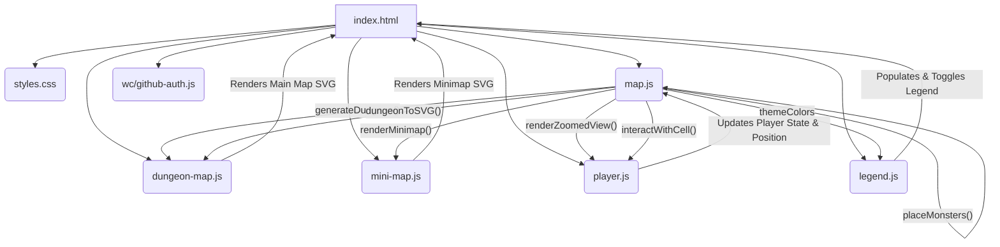

### Architecture Document Plan: Rogue Game - Current State

#### 1. Introduction
*   Provide a brief overview of the "Rogue Game" as a browser-based dungeon crawler.
*   Clearly state that this document focuses exclusively on the *current implementation* as reflected in the existing files, without delving into the future AI-driven phases outlined in `game_idea.md`.

#### 2. Core Components and Their Responsibilities

*   **`index.html`**:
    *   Describe its role as the main entry point for the application.
    *   Explain how it links `styles.css` for visual presentation.
    *   List and describe the core JavaScript modules it includes: `map.js`, `mini-map.js`, `dungeon-map.js`, `player.js`.
    *   Detail the HTML elements it defines for the main dungeon view (`zoomed-view`), minimap (`minimap`), and legend (`legend`).
    *   Mention the integration of the `github-auth` web component and its current unknown specific role.
*   **`styles.css`**:
    *   Explain its function in providing styling for all visual elements of the game, including dungeon cells, the minimap, and the legend.
*   **`map.js`**:
    *   **Dungeon Generation Logic**: Detail its role as the central hub for algorithms that generate the dungeon layout (rooms, corridors, doors).
    *   **Data Definitions**: Specify that it defines the core `DungeonCell` and `Monster` data structures.
    *   **Theming**: Describe how it manages `themeColors` and `themes` for different room types and their associated monster pools.
    *   **Rendering Utilities**: Highlight its provision of `dungeonToSVG` for the main map and `renderMinimap` for the minimap.
    *   **Basic Game Logic**: Note the inclusion of `placeMonsters` for populating the dungeon and `interactWithCell` for handling basic player interactions.
*   **`dungeon-map.js`**:
    *   Describe it as a custom HTML element (`<dungeon-map>`).
    *   Explain its responsibilities: initializing and rendering the main dungeon view by utilizing `generateDungeon` and `dungeonToSVG` from `map.js`.
    *   Mention its dynamic adjustment of dungeon size based on window dimensions.
*   **`mini-map.js`**:
    *   Describe it as a custom HTML element (`<mini-map>`) or script.
    *   Explain its purpose: rendering a smaller, overview map of the dungeon, likely using `renderMinimap` from `map.js` and handling fog of war/visibility.
*   **`player.js`**:
    *   Outline its presumed role in managing player state (position, health, etc.) and handling player movement and interaction within the dungeon.
*   **`legend.js`**:
    *   Detail its function in populating and managing the visibility of the dungeon legend.
    *   Note its use of `themeColors` (and the current duplication with `map.js`).
    *   Describe its control over the "Show Legend" / "Hide Legend" button.
*   **`/wc/github-auth.js`**:
    *   Identify it as a web component for GitHub authentication, acknowledging that its specific integration and purpose within the current game mechanics are not fully evident.

#### 3. Data Structures

*   **`DungeonCell`**:
    *   `type`: (`'wall'`, `'floor'`, `'door'`)
    *   `theme`: (`string | null`, e.g., `'library'`, `'armory'`, or `null` for corridors)
    *   `explored`: (`boolean`, for fog of war)
    *   `visible`: (`boolean`, for current player view)
    *   `monster`: (`Monster | null`)
*   **`Monster`**:
    *   `name`: (`string`)
    *   `health`: (`number`)
    *   `attack`: (`number`)
    *   `behavior`: (`string`, `'aggressive'`, `'passive'`, `'patrolling'`)

#### 4. Dungeon Generation Flow

1.  **Initialization**: `dungeon-map.js`'s `connectedCallback` initiates the dungeon generation process.
2.  **Grid Creation**: A 2D array of `DungeonCell` objects is created, initially filled with 'wall' cells.
3.  **Room Placement**: Randomly sized and themed rooms are carved out within the grid.
4.  **Corridor Connection**: Rooms are interconnected using a spanning tree approach, employing both L-shaped and winding corridor generation methods.
5.  **Door Placement**: Doors are strategically placed at the boundaries where corridors meet room entrances, based on a probability.
6.  **Corridor Widening**: An optional post-processing step to randomly widen some corridors for visual variety.
7.  **Monster Placement**: Monsters are randomly placed within themed rooms, with their type determined by the room's theme.

#### 5. Rendering Mechanism

*   **Main Dungeon View**:
    *   The `dungeonToSVG` function in `map.js` converts the 2D dungeon array into an SVG string.
    *   This SVG is then injected into the shadow DOM of the `<dungeon-map>` custom element.
    *   Cells are colored based on their `type` and `theme` using the `themeColors` mapping.
*   **Minimap**:
    *   The `renderMinimap` function in `map.js` generates a separate SVG for the minimap.
    *   This rendering incorporates a fog of war effect, showing only `explored` cells.
    *   The `<mini-map>` custom element is responsible for displaying this minimap.
*   **Zoomed View**:
    *   The `renderZoomedView` function in `map.js` is identified as the mechanism for rendering a detailed view around the player's current position.

#### 6. Interactions

*   **Legend**: `legend.js` controls the display and toggling of a legend that explains the color coding of dungeon cells.
*   **Player Movement/Interaction**: `player.js` (in conjunction with `interactWithCell` in `map.js`) is responsible for handling player actions, movement within the dungeon, and encounters with monsters.

#### 7. Component Interaction Diagram

#### 8. Potential Areas for Improvement / Future Work (Briefly)

*   **Centralized Theme Data**: The `themeColors` object is duplicated in `map.js` and `legend.js`. This should be refactored into a single, centralized source to ensure consistency and maintainability.
*   **AI Integration**: Acknowledge that the `game_idea.md` outlines significant AI integration for code generation and dynamic content, which is currently a commented-out feature (`openai.js`) and represents a major future development phase.
*   **Player Logic Elaboration**: The full scope of `player.js` and its detailed interactions with the dungeon state could be further clarified.
*   **Game Loop Definition**: A more explicit and centralized game loop (e.g., for update and render cycles) could improve the overall structure.
*   **Robust Error Handling**: Implement more comprehensive error handling, especially for dynamically generated content, as suggested in the `game_idea.md`.