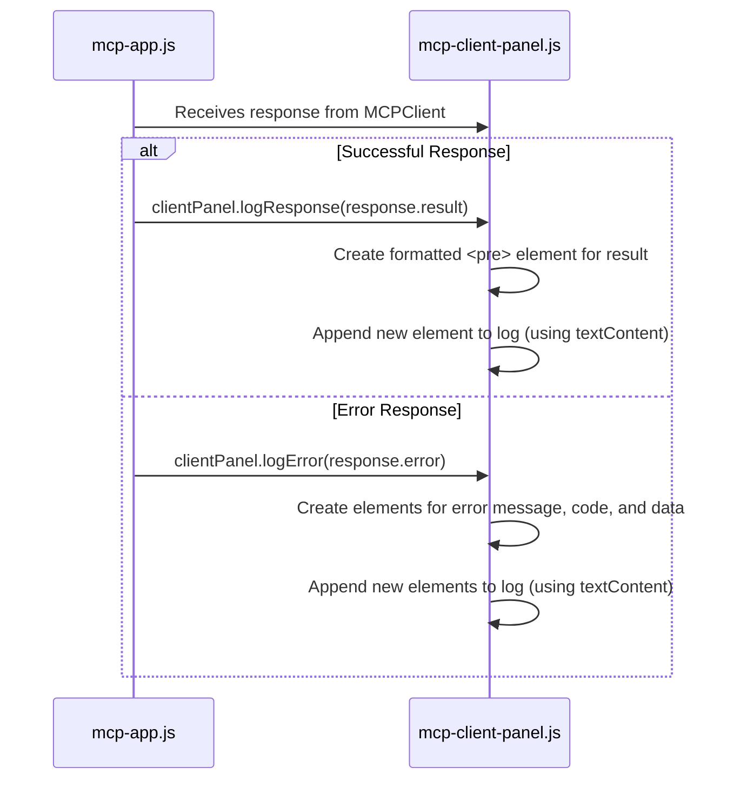

# Plan: Refactor Client-Side Logging

This plan details the refactoring of the client-side logging mechanism to improve code quality, security, and user experience.

---

### 1. Summary of Changes

The primary goal is to refactor the logging logic in `mcp-app.js` and `mcp-client-panel.js`. We will move all DOM manipulation and formatting logic into the `mcp-client-panel` component, making it the single source of truth for how logs are displayed. This improves separation of concerns and makes the system more maintainable.

### 2. Architecture Diagram

This diagram illustrates the proposed flow. `mcp-app.js` passes raw data objects (`result` or `error`) to the `ClientPanel`, which handles all rendering.

---

### 3. Implementation Steps

#### A. Modify `mcp-app.js`

The `client-send-message` event listener will be updated to delegate logging to the client panel.

-   **File to Modify**: `mcp/mcp-app.js`
-   **Change**:
    -   In the `try` block, after receiving a `response`, check if `response.error` exists.
    -   If an error exists, call a new `clientPanel.logError(response.error)` method.
    -   Otherwise, call a new `clientPanel.logResponse(response.result)` method.
    -   A call to a new `clientPanel.logInfo()` method will log the initial "Message sent" text.

#### B. Refactor `mcp-client-panel.js`

The component will be updated to handle the new logging methods and improve security.

-   **File to Modify**: `mcp/components/mcp-client-panel.js`
-   **Changes**:
    1.  **Remove `innerHTML`**: Replace the existing `addLog` method. All DOM elements will be created with `document.createElement` and text will be set with `textContent` to prevent XSS vulnerabilities.
    2.  **Create Private Helper**: Implement a private `_createLogEntry(content, type)` method to reduce code duplication for creating the timestamped log container.
    3.  **Implement `logInfo(message)`**: A public method for logging simple informational strings.
    4.  **Implement `logResponse(result)`**: A public method that takes a JSON object, stringifies it with formatting, and displays it within a `<pre>` tag for readability.
    5.  **Implement `logError(error)`**: A public method that takes a JSON-RPC error object. It will display the error message and code. If the `error.data` field is an array (for validation errors), it will iterate over the array and display each error detail in a list.

### 4. Benefits of Refactoring

-   **Readability & Maintainability**: Code is cleaner, with single-purpose methods and clear separation of concerns.
-   **Security**: Eliminates `innerHTML` usage, protecting against XSS attacks.
-   **Improved Error Handling**: Provides detailed, structured error reports in the UI, making debugging significantly easier.
-   **Best Practices**: Aligns with modern web development patterns where components are responsible for their own view logic.