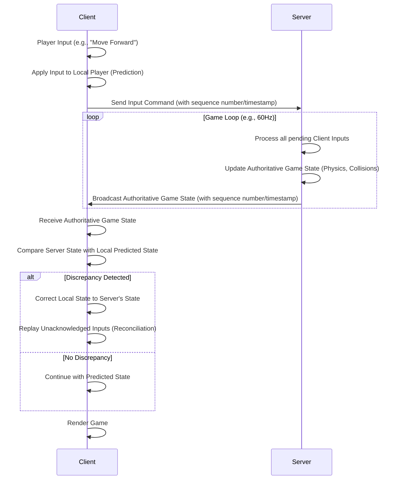

# Multiplayer Game Client Synchronization Plan

This document outlines a detailed plan for implementing a robust client-server synchronization system for a multiplayer Asteroids-style game. The backend will be implemented using Deno 2, and the frontend will utilize standard browser APIs, with a reusable JavaScript module for client-side logic.

## Goal

Implement a robust client-server synchronization system for a multiplayer Asteroids-style game, ensuring smooth and consistent gameplay across all connected clients.

## Key Technologies

*   **Backend:** Deno 2 (for WebSocket server and game logic, located in `/server/`)
*   **Frontend:** Standard Browser APIs (for WebSocket client and game rendering, with reusable JS in `/js/`)

## Core Principles

*   **Server Authoritative:** The Deno backend will be the single source of truth for the game state. Clients will send inputs, and the server will process them, update the authoritative state, and broadcast the new state to all clients. This prevents cheating and ensures consistency.
*   **Real-time Communication:** WebSockets will provide a persistent, full-duplex communication channel for low-latency updates.
*   **Client-Side Prediction & Reconciliation:** To mitigate network latency, clients will predict their own movements and the movements of other entities. The server's authoritative updates will then be used to reconcile any discrepancies, correcting the client's predicted state.

---

## Detailed Plan

### Phase 1: Backend (Deno) Implementation (`/server/`)

1.  **WebSocket Server Setup:**
    *   Create a Deno HTTP server that upgrades incoming connections to WebSockets.
    *   Handle new client connections, assigning a unique ID to each player.
    *   Manage a list of active WebSocket connections.
    *   Implement error handling for WebSocket connections (e.g., connection close, errors).

2.  **Game State Management:**
    *   Maintain a central, authoritative game state object on the server. This object will include:
        *   An array of player objects (each with ID, position, orientation, velocity, health, etc.).
        *   An array of bullet objects (each with ID, position, velocity, owner ID, etc.).
        *   Asteroid states (position, velocity, size, etc.).
    *   Implement functions to update this game state based on client inputs and server-side physics.

3.  **Game Loop & State Broadcasting:**
    *   Implement a server-side game loop (e.g., using `setInterval` or `Deno.run` with a fixed tick rate, aiming for 60 ticks per second).
    *   Within each tick:
        *   Process all pending client inputs.
        *   Update the authoritative game state (move players, bullets, asteroids, handle collisions).
        *   Serialize the relevant parts of the game state (e.g., `JSON.stringify` or a more efficient binary format like MessagePack if performance becomes an issue).
        *   Broadcast the serialized game state to all connected WebSocket clients.

4.  **Input Handling:**
    *   Clients will send input commands (e.g., "move forward", "turn left", "fire") to the server via their WebSocket connection.
    *   The server will receive these inputs, validate them, and apply them to the corresponding player's state within the game loop.
    *   Consider input buffering and processing inputs in batches to optimize server performance.

---

### Phase 2: Frontend (Browser) Implementation (`/js/`)

1.  **WebSocket Client Connection:**
    *   Establish a WebSocket connection to the Deno backend from the browser.
    *   Handle connection open, close, and error events.
    *   Implement reconnection logic for dropped connections.

2.  **Input Sending:**
    *   Capture player input (keyboard, mouse) and send it to the Deno server via the WebSocket connection.
    *   Consider sending only "delta" inputs (e.g., key down/up events) rather than continuous state.

3.  **Game State Reception & Application:**
    *   Receive serialized game state updates from the server via the WebSocket.
    *   Deserialize the received data.
    *   Apply the authoritative game state to the client's local game representation.

4.  **Client-Side Prediction & Reconciliation:**
    *   **Prediction:** When a client sends an input, immediately apply that input to its local player character. This makes the game feel responsive.
    *   **Interpolation/Extrapolation:** For other players and entities, use the received server state to interpolate their positions between updates for smooth movement. If updates are delayed, extrapolate their positions based on their last known velocity.
    *   **Reconciliation:** When an authoritative update for the client's own player arrives from the server, compare the server's state with the client's predicted state. If there's a discrepancy, correct the client's local state to match the server's, potentially replaying inputs that occurred since the server's last acknowledged state.

---

### Phase 3: Optimization & Refinements (Iterative)

1.  **Data Serialization:**
    *   Start with JSON for simplicity. If bandwidth or parsing overhead becomes an issue, explore binary serialization formats (e.g., MessagePack, FlatBuffers).
2.  **Lag Compensation:**
    *   Implement techniques like "rollback" on the server for hit detection (e.g., bullets) to account for client latency, making hits feel more accurate from the client's perspective.
3.  **Bandwidth Management:**
    *   Only send necessary data. For example, if an entity hasn't moved, don't send its position.
    *   Consider sending "diffs" or deltas of the game state instead of the full state if the state is large and changes are incremental.
4.  **Scalability Considerations:**
    *   While Deno is performant, for a very large number of concurrent players, consider strategies like sharding or dedicated game servers. (Likely not needed for an Asteroids game initially).
5.  **Error Handling & Robustness:**
    *   Implement comprehensive error handling on both client and server.
    *   Graceful handling of disconnections and network issues.

---

## Architectural Diagram

```mermaid
graph TD
    subgraph Client (Browser)
        C[Game Logic & Rendering] --> |Sends Input| WS_C(WebSocket Client)
        WS_C --> |Receives State Updates| C
        C --> CP(Client-Side Prediction & Reconciliation)
    end

    subgraph Server (Deno Backend)
        WS_S(WebSocket Server) --> |Manages Connections| GS(Authoritative Game State)
        WS_S --> |Receives Input| GL(Game Loop)
        GL --> |Updates State| GS
        GS --> |Broadcasts State| WS_S
    end

    WS_C <--> |WebSocket Connection| WS_S

    style C fill:#f9f,stroke:#333,stroke-width:2px
    style WS_C fill:#ccf,stroke:#333,stroke-width:2px
    style CP fill:#fcf,stroke:#333,stroke-width:2px
    style WS_S fill:#ccf,stroke:#333,stroke-width:2px
    style GS fill:#9cf,stroke:#333,stroke-width:2px
    style GL fill:#9ff,stroke:#333,stroke-width:2px
```

---

## Detailed Explanation: Client-Side Prediction and Reconciliation

### Client-Side Prediction

**What it is:**
Client-side prediction is a technique where the client immediately simulates the effects of its own actions without waiting for confirmation from the server. When a player presses a key to move their ship, the client updates the ship's position on the screen *instantly*.

**Why it's important:**
*   **Responsiveness:** It eliminates the perceived lag between a player's input and the visual feedback on their screen. Without it, players would experience a noticeable delay (equal to their round-trip time to the server) every time they moved or fired, making the game feel sluggish and unresponsive.
*   **Smoothness:** It helps maintain a consistent frame rate and smooth animation, as the client isn't constantly waiting for server updates to render its own player's movement.

**How it works (simplified):**
1.  **Input:** The client captures a player's input (e.g., "move forward").
2.  **Prediction:** The client immediately applies this input to its local simulation of the player's ship, updating its position, velocity, and orientation.
3.  **Send Input:** The client sends this input command to the server.
4.  **Render:** The client renders the game state, including the predicted movement of its own ship.

### Reconciliation (or Server Reconciliation/Correction)

**What it is:**
Reconciliation is the process of correcting the client's predicted state with the authoritative state received from the server. Since the server is the ultimate source of truth, the client must eventually align its view of the game with what the server dictates.

**Why it's important:**
*   **Authoritativeness:** Ensures that all clients eventually agree on the true game state, preventing desynchronization and potential cheating.
*   **Fairness:** Resolves conflicts that arise from network latency (e.g., two players firing at the same time, but one's shot registers first on the server).
*   **Consistency:** Guarantees that the game logic (e.g., collision detection, scoring) is consistently applied across all clients based on the server's calculations.

**How it works (simplified):**
1.  **Server Update:** The server processes the client's input (and inputs from all other clients), updates its authoritative game state, and sends this updated state back to the client. This update typically includes a timestamp or a sequence number corresponding to the inputs it has processed.
2.  **Receive Update:** The client receives the authoritative game state from the server.
3.  **Compare:** The client compares the received authoritative state for its own player with its current predicted local state.
4.  **Replay/Correct:**
    *   If the server's state matches the client's prediction, no correction is needed.
    *   If there's a discrepancy (e.g., due to network jitter, packet loss, or server-side physics differences), the client "snaps" its player's position to the server's authoritative position.
    *   To make this correction smooth, the client might "replay" any inputs it has processed *since* the server's acknowledged state, applying them to the newly received authoritative state. This helps to smoothly transition the client's view without jarring jumps.

### Putting it Together: The Flow



### Key Considerations for Implementation:

*   **Input Buffering:** On the client, you'll need to store a history of inputs sent to the server, along with the predicted state at the time those inputs were applied. This history is crucial for replaying inputs during reconciliation.
*   **State Snapshots:** The server sends snapshots of the game state. These snapshots should be as compact as possible to minimize bandwidth.
*   **Interpolation/Extrapolation for Other Entities:** While prediction/reconciliation is for the *local* player, other players and entities (asteroids, bullets) will also need smooth movement. This is typically achieved by interpolating their positions between received server updates. If a new update hasn't arrived, you might extrapolate their position based on their last known velocity.
*   **Jitter Buffering:** Clients can implement a small buffer to smooth out network jitter, ensuring a consistent rate of updates to the game logic.
*   **Latency Simulation (for testing):** When developing, it's invaluable to simulate network latency to properly test your prediction and reconciliation logic.

---

## Detailed Explanation: Data Serialization Options

The goal is to convert your game state (player positions, velocities, bullet states, etc.) into a format that can be sent efficiently over the network and then quickly converted back into usable data on the receiving end.

#### 1. JSON (JavaScript Object Notation)

*   **Description:** A human-readable, text-based format widely used for data interchange. It's native to JavaScript, making it very easy to work with in the browser and Deno.
*   **Pros:**
    *   **Simplicity:** Extremely easy to implement and debug. Deno and browsers have built-in `JSON.stringify()` and `JSON.parse()` methods.
    *   **Human-readable:** Easy to inspect and understand the data being sent, which is great for development and debugging.
    *   **Widely supported:** No external libraries are needed for basic usage in Deno or the browser.
*   **Cons:**
    *   **Verbosity:** Text-based formats are generally larger than binary formats because they include key names, whitespace, and string representations of numbers. For 60 updates/second, this can add up quickly.
    *   **Parsing Overhead:** While fast, parsing text can be slower than parsing binary data, especially for large payloads.
*   **When to use:**
    *   **Initial Development:** Start with JSON. It's the quickest way to get something working and debug your game state.
    *   **Low Player Count / Simple State:** If your game state is relatively small and the number of concurrent players is low, JSON might be sufficient.
    *   **Input Commands:** For client inputs (e.g., "move forward"), JSON is often perfectly fine as these messages are typically small.

#### 2. Binary Formats (e.g., MessagePack, FlatBuffers, Protocol Buffers)

These formats encode data into a compact binary representation, significantly reducing message size and often improving parsing performance. They require a schema definition and libraries for encoding/decoding.

*   **MessagePack:**
    *   **Description:** A binary serialization format that's more compact than JSON but still relatively easy to use. It's often called "binary JSON."
    *   **Pros:**
        *   **Compactness:** Much smaller message sizes than JSON.
        *   **Speed:** Faster encoding and decoding than JSON.
        *   **Schema-less (mostly):** Doesn't strictly require a predefined schema, making it more flexible than Protocol Buffers or FlatBuffers, though defining your data structure is still good practice.
    *   **Cons:**
        *   **Not human-readable:** You'll need a MessagePack decoder to inspect the raw data.
        *   **Library Dependency:** Requires a MessagePack library on both Deno and the browser.
    *   **When to use:**
        *   When JSON becomes a bottleneck due to bandwidth or parsing speed, but you want to avoid the complexity of strict schema-based formats. It's a good "next step" optimization.

*   **Protocol Buffers (Protobuf):**
    *   **Description:** A language-neutral, platform-neutral, extensible mechanism for serializing structured data. You define your data structure in a `.proto` file, and then use a `protoc` compiler to generate code for various languages (including TypeScript/JavaScript for Deno and browser).
    *   **Pros:**
        *   **Extreme Compactness:** Highly optimized for size.
        *   **Performance:** Very fast encoding and decoding.
        *   **Schema Enforcement:** The schema ensures data consistency and makes it easy to evolve your data structures over time.
        *   **Language Agnostic:** Great for multi-language environments.
    *   **Cons:**
        *   **Complexity:** Requires defining `.proto` files and using a code generator. This adds a build step and more upfront work.
        *   **Not human-readable:** Binary format.
        *   **Strict Schema:** Changes to the schema need careful management to maintain backward/forward compatibility.
    *   **When to use:**
        *   For high-performance, high-scale applications where every byte and millisecond counts. If your game becomes very popular and you need to optimize heavily, Protobuf is a strong contender.

*   **FlatBuffers:**
    *   **Description:** A serialization library for games and other memory-constrained apps. It allows you to access serialized data directly without parsing/unpacking it first, which can be extremely fast.
    *   **Pros:**
        *   **Zero-copy deserialization:** Data can be read directly from the buffer, avoiding memory allocations and copying. This is its main advantage for performance.
        *   **Compactness:** Very efficient.
    *   **Cons:**
        *   **Complexity:** Even more complex to use than Protocol Buffers, especially for beginners.
        *   **Schema-based:** Requires `.fbs` schema files and code generation.
    *   **When to use:**
        *   If you hit extreme performance bottlenecks with other formats, particularly related to deserialization speed and memory usage. Less common for typical browser-based games unless they are very complex.

#### 3. Custom Binary Format

*   **Description:** You define your own byte-level encoding scheme. For example, a player's X position could be a 2-byte integer, Y position another 2-byte integer, etc.
*   **Pros:**
    *   **Maximum Control & Compactness:** You can tailor the format precisely to your data, achieving the absolute smallest possible message size.
    *   **Potentially Fastest:** If implemented correctly, can be extremely fast to encode/decode.
*   **Cons:**
    *   **Highest Complexity:** Requires meticulous byte-level manipulation (e.g., using `DataView` or `Uint8Array` in JavaScript/TypeScript).
    *   **Error-prone:** Easy to make mistakes with byte offsets and data types.
    *   **Maintenance Nightmare:** Very difficult to debug and evolve the format.
*   **When to use:**
    *   Only as a last resort if all other optimized binary formats prove insufficient, and you have a deep understanding of network protocols and binary data. This is rarely necessary for most browser games.

#### 4. Delta Compression / State Differencing

*   **Description:** Instead of sending the entire game state, you only send the *changes* (deltas) from the previous state. This can be combined with any of the above serialization formats.
*   **Pros:**
    *   **Significant Bandwidth Savings:** If only a small portion of the game state changes between updates, this can drastically reduce message size.
*   **Cons:**
    *   **Complexity:** Requires tracking the previous state on both client and server, calculating diffs, and handling potential out-of-order or lost delta messages.
    *   **Full State Sync:** Periodically, you'll still need to send a full game state snapshot to ensure clients don't drift too far out of sync due to lost deltas.
*   **When to use:**
    *   As an advanced optimization *after* you've chosen a base serialization format (JSON, MessagePack, etc.) and identified bandwidth as a primary bottleneck.

### Recommendation for Your Asteroids Game:

1.  **Start with JSON:** It's the easiest to implement and debug. Get your core game loop, WebSocket communication, and basic prediction/reconciliation working first.
2.  **Profile and Optimize:** Once you have a working prototype, use browser developer tools and Deno's profiling capabilities to identify bottlenecks.
    *   If network bandwidth is the issue (large JSON messages), consider **MessagePack**.
    *   If CPU usage for parsing is the issue, or if you need even greater compactness, then **Protocol Buffers** would be the next logical step.
3.  **Consider Delta Compression Later:** If, after optimizing your base serialization, you still find bandwidth to be a major constraint, then explore delta compression.

This iterative approach allows you to build quickly and optimize only where necessary, avoiding premature optimization.